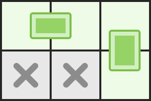

# 覆盖

输出：一个整数，代表最多能在棋盘上放的骨牌数。

**示例 1：**



``` javascript
输入：n = 2, m = 3, broken = [[1, 0], [1, 1]]
输出：2
解释：我们最多可以放两块骨牌：[[0, 0], [0, 1]]以及[[0, 2], [1, 2]]。（见下图）
```

**示例 2：**


``` javascript
输入：n = 3, m = 3, broken = []
输出：4
解释：下图是其中一种可行的摆放方式
```

**限制：**

- 1 <= n <= 8
- 1 <= m <= 8
- 0 <= b <= n * m

**解答：**

**#**|**编程语言**|**时间（ms / %）**|**内存（MB / %）**|**代码**
--|--|--|--|--
1|javascript|?? / 100|?? / 100|[??](./javascript/ac_v1.js)

来源：力扣（LeetCode）

链接：https://leetcode-cn.com/problems/broken-board-dominoes

著作权归领扣网络所有。商业转载请联系官方授权，非商业转载请注明出处。
