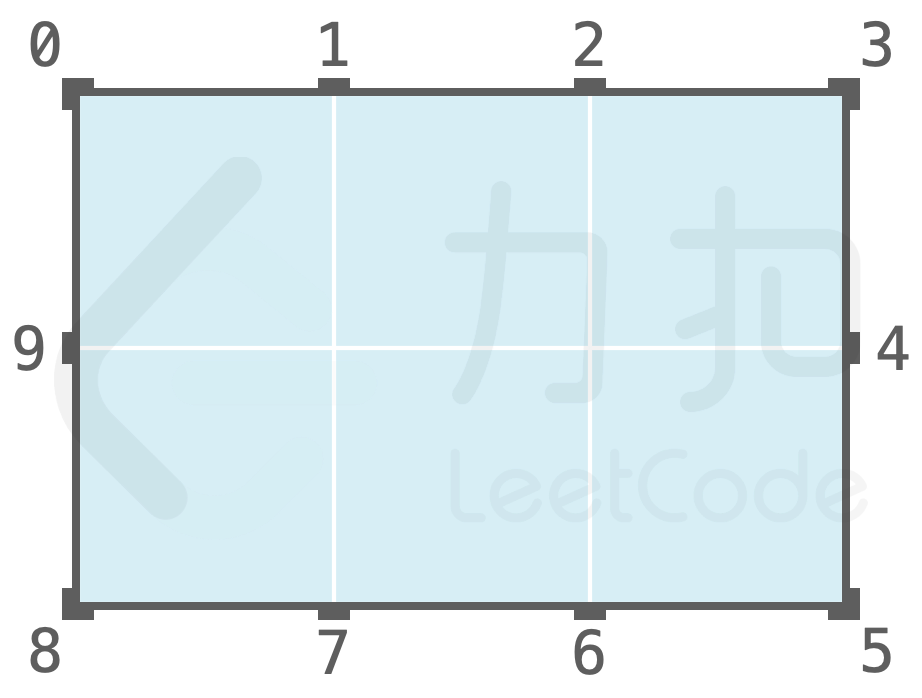
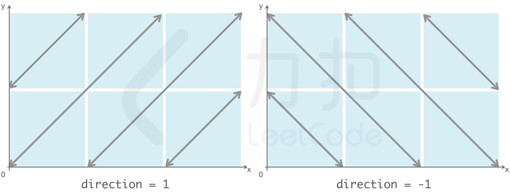
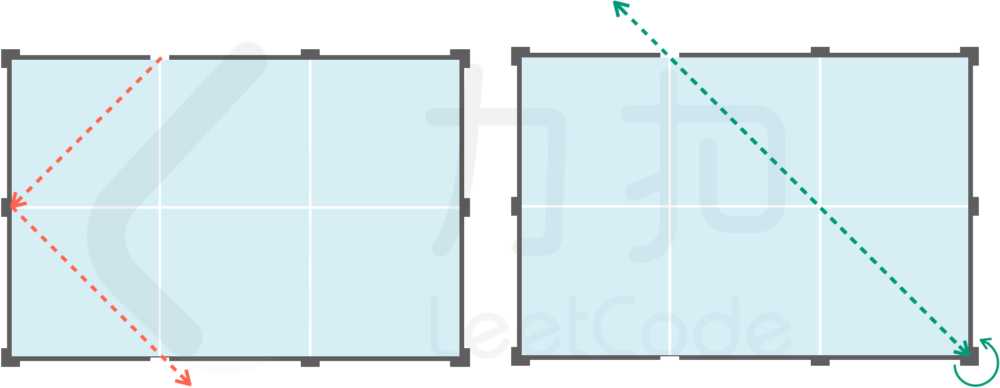
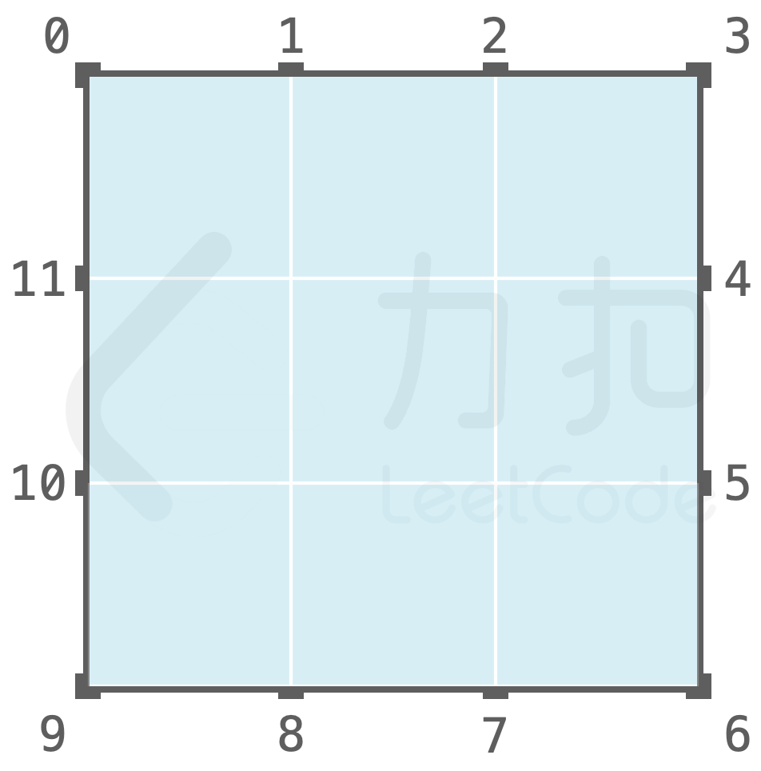

# 黑盒光线反射

秋日市集上有个奇怪的黑盒，黑盒的主视图为 n * m 的矩形。从黑盒的主视图来看，黑盒的上面和下面各均匀分布有 m 个小孔，黑盒的左面和右面各均匀分布有 n 个小孔。黑盒左上角小孔序号为 0，按顺时针编号，总共有 2 * (m+n) 个小孔。每个小孔均可以打开或者关闭，初始时，所有小孔均处于关闭状态。每个小孔上的盖子均为镜面材质。例如一个 2 * 3 的黑盒主视图与其小孔分布如图所示:



店长告诉小扣，这里是「几何学的快问快答」，店长可能有两种操作：

- open(int index, int direction) - 若小孔处于关闭状态，则打开小孔，照入光线；否则直接照入光线；
- close(int index) - 关闭处于打开状态小孔，店长保证不会关闭已处于关闭状态的小孔；

其中：

- index： 表示小孔序号
- direction：1 表示光线沿 y=xy=x 方向，-1 表示光线沿 y=-xy=−x 方向。



当光线照至边界时：若边界上的小孔为开启状态，则光线会射出；否则，光线会在小孔之间进行反射。特别地：

- 若光线射向未打开的拐角（黑盒顶点），则光线会原路反射回去；
- 光线自拐角处的小孔照入时，只有一种入射方向（如自序号为 0 的小孔照入方向只能为 -1）



请帮助小扣判断并返回店长每次照入的光线从几号小孔射出。

**示例 1：**

``` javascript
输入：
["BlackBox","open","open","open","close","open"]
[[2,3],[6,-1],[4,-1],[0,-1],[6],[0,-1]]

输出：[null,6,4,6,null,4]

解释：
BlackBox b = BlackBox(2,3); // 新建一个 2x3 的黑盒
b.open(6,-1) // 打开 6 号小孔，并沿 y=-x 方向照入光线，光线至 0 号小孔反射，从 6 号小孔射出
b.open(4,-1) // 打开 4 号小孔，并沿 y=-x 方向照入光线，光线轨迹为 4-2-8-2-4，从 4 号小孔射出
b.open(0,-1) // 打开 0 号小孔，并沿 y=-x 方向照入光线，由于 6 号小孔为开启状态，光线从 6 号小孔射出
b.close(6) // 关闭 6 号小孔
b.shoot(0,-1) // 从 0 号小孔沿 y=-x 方向照入光线，由于 6 号小孔为关闭状态，4 号小孔为开启状态，光线轨迹为 0-6-4，从 4 号小孔射出
```

**示例 2：**

``` javascript
输入：
["BlackBox","open","open","open","open","close","open","close","open"]
[[3,3],[1,-1],[5,1],[11,-1],[11,1],[1],[11,1],[5],[11,-1]]

输出：[null,1,1,5,1,null,5,null,11]

解释：
```



``` javascript
BlackBox b = BlackBox(3,3); // 新建一个 3x3 的黑盒
b.open(1,-1) // 打开 1 号小孔，并沿 y=-x 方向照入光线，光线轨迹为 1-5-7-11-1，从 1 号小孔射出
b.open(5,1) // 打开 5 号小孔，并沿 y=x 方向照入光线，光线轨迹为 5-7-11-1，从 1 号小孔射出
b.open(11,-1) // 打开 11 号小孔，并沿逆 y=-x 方向照入光线，光线轨迹为 11-7-5，从 5 号小孔射出
b.open(11,1) // 从 11 号小孔沿 y=x 方向照入光线，光线轨迹为 11-1，从 1 号小孔射出
b.close(1) // 关闭 1 号小孔
b.open(11,1) // 从 11 号小孔沿 y=x 方向照入光线，光线轨迹为 11-1-5，从 5 号小孔射出
b.close(5) // 关闭 5 号小孔
b.open(11,-1) // 从 11 号小孔沿 y=-x 方向照入光线，光线轨迹为 11-1-5-7-11，从 11 号小孔射出
```

**提示：**

- 1 <= n, m <= 10000
- 1 <= 操作次数 <= 10000
- direction 仅为 1 或 -1
- 0 <= index < 2*(m+n)

**解答：**

**#**|**编程语言**|**时间（ms / %）**|**内存（MB / %）**|**代码**
--|--|--|--|--
1|javascript|?? / ??|?? / ??|[??](./javascript/ac_v1.js)

来源：力扣（LeetCode）

链接：https://leetcode-cn.com/problems/IQvJ9i

著作权归领扣网络所有。商业转载请联系官方授权，非商业转载请注明出处。
