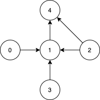

# 可以到达所有点的最少点数目

给你一个 **有向无环图**， n 个节点编号为 0 到 n-1 ，以及一个边数组 edges ，其中 edges[i] = [fromi, toi] 表示一条从点  fromi 到点 toi 的有向边。

找到最小的点集使得从这些点出发能到达图中所有点。题目保证解存在且唯一。

你可以以任意顺序返回这些节点编号。

**示例 1：**


``` javascript
输入：n = 6, edges = [[0,1],[0,2],[2,5],[3,4],[4,2]]
输出：[0,3]
解释：从单个节点出发无法到达所有节点。从 0 出发我们可以到达 [0,1,2,5] 。从 3 出发我们可以到达 [3,4,2,5] 。所以我们输出 [0,3] 。
```

**示例 2：**



``` javascript
输入：n = 5, edges = [[0,1],[2,1],[3,1],[1,4],[2,4]]
输出：[0,2,3]
解释：注意到节点 0，3 和 2 无法从其他节点到达，所以我们必须将它们包含在结果点集中，这些点都能到达节点 1 和 4 。
```

**提示：**

- 2 <= n <= 10^5
- 1 <= edges.length <= min(10^5, n * (n - 1) / 2)
- edges[i].length == 2
- 0 <= fromi, toi < n
- 所有点对 (fromi, toi) 互不相同。

**解答：**

**#**|**编程语言**|**时间（ms / %）**|**内存（MB / %）**|**代码**
--|--|--|--|--
1|javascript|252 / 100|65.6 / 100|[朴素方法&hash优化](./javascript/ac_v1.js)

来源：力扣（LeetCode）

链接：https://leetcode-cn.com/problems/minimum-number-of-vertices-to-reach-all-nodes

著作权归领扣网络所有。商业转载请联系官方授权，非商业转载请注明出处。
