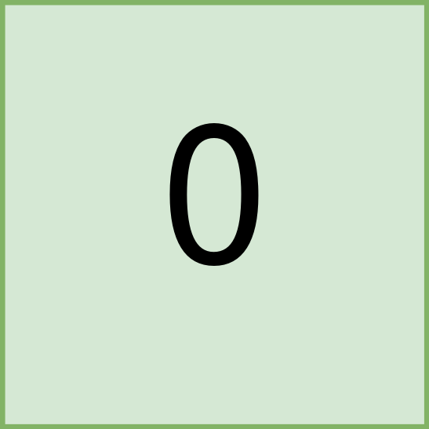

# 找到所有的农场组

给你一个下标从 **0** 开始，大小为 m x n 的二进制矩阵 land ，其中 0 表示一单位的森林土地，1 表示一单位的农场土地。

为了让农场保持有序，农场土地之间以矩形的 **农场组** 的形式存在。每一个农场组都 **仅** 包含农场土地。且题目保证不会有两个农场组相邻，也就是说一个农场组中的任何一块土地都 **不会** 与另一个农场组的任何一块土地在四个方向上相邻。

land 可以用坐标系统表示，其中 land 左上角坐标为 (0, 0) ，右下角坐标为 (m-1, n-1) 。请你找到所有 **农场组** 最左上角和最右下角的坐标。一个左上角坐标为 (r1, c1) 且右下角坐标为 (r2, c2) 的 **农场组** 用长度为 4 的数组 [r1, c1, r2, c2] 表示。

请你返回一个二维数组，它包含若干个长度为 4 的子数组，每个子数组表示 land 中的一个 **农场组**。如果没有任何农场组，请你返回一个空数组。可以以 **任意顺序** 返回所有农场组。

**示例 1：**


``` javascript
输入：land = [[1,0,0],[0,1,1],[0,1,1]]
输出：[[0,0,0,0],[1,1,2,2]]
解释：
第一个农场组的左上角为 land[0][0] ，右下角为 land[0][0] 。
第二个农场组的左上角为 land[1][1] ，右下角为 land[2][2] 。
```

**示例 2：**


``` javascript
输入：land = [[1,1],[1,1]]
输出：[[0,0,1,1]]
解释：
第一个农场组左上角为 land[0][0] ，右下角为 land[1][1] 。
```

**示例 3：**



``` javascript
输入：land = [[0]]
输出：[]
解释：
没有任何农场组。
```

**提示：**

- m == land.length
- n == land[i].length
- 1 <= m, n <= 300
- land 只包含 0 和 1 。
- 农场组都是 **矩形** 的形状。

**解答：**

**#**|**编程语言**|**时间（ms / %）**|**内存（MB / %）**|**代码**
--|--|--|--|--
1|javascript|6008 / 100|61.9 / 100|[朴素方法](./javascript/ac_v1.js)

来源：力扣（LeetCode）

链接：https://leetcode-cn.com/problems/find-all-groups-of-farmland

著作权归领扣网络所有。商业转载请联系官方授权，非商业转载请注明出处。
