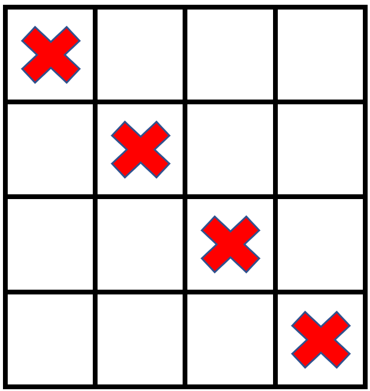

# 用邮票贴满网格图

给你一个 `m x n` 的二进制矩阵 `grid` ，每个格子要么为 `0` （空）要么为 `1` （被占据）。

给你邮票的尺寸为 `stampHeight x stampWidth` 。我们想将邮票贴进二进制矩阵中，且满足以下 **限制** 和 **要求** ：

- 覆盖所有 **空** 格子。
- 不覆盖任何 **被占据** 的格子。
- 我们可以放入任意数目的邮票。
- 邮票可以相互有 **重叠** 部分。
- 邮票不允许 **旋转** 。
- 邮票必须完全在矩阵 **内** 。

如果在满足上述要求的前提下，可以放入邮票，请返回 `true` ，否则返回 `false` 。

**示例 1：**


``` javascript
输入：grid = [[1,0,0,0],[1,0,0,0],[1,0,0,0],[1,0,0,0],[1,0,0,0]], stampHeight = 4, stampWidth = 3
输出：true
解释：我们放入两个有重叠部分的邮票（图中标号为 1 和 2），它们能覆盖所有与空格子。
```

**示例 2：**



``` javascript
输入：grid = [[1,0,0,0],[0,1,0,0],[0,0,1,0],[0,0,0,1]], stampHeight = 2, stampWidth = 2 
输出：false
解释：没办法放入邮票覆盖所有的空格子，且邮票不超出网格图以外。
```

**提示：**

- `m == grid.length`
- `n == grid[r].length`
- `1 <= m, n <= 1e5`
- `1 <= m * n <= 2 * 1e5`
- `grid[r][c]` 要么是 `0` ，要么是 `1` 。
- `1 <= stampHeight, stampWidth <= 1e5`

**解答：**

**#**|**编程语言**|**时间（ms / %）**|**内存（MB / %）**|**代码**
--|--|--|--|--
1|javascript|?? / 100|?? / 100|[??](./javascript/ac_v1.js)

来源：力扣（LeetCode）

链接：https://leetcode-cn.com/problems/stamping-the-grid

著作权归领扣网络所有。商业转载请联系官方授权，非商业转载请注明出处。
