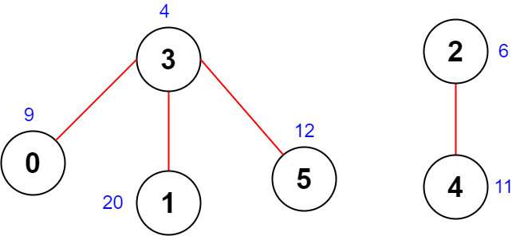

# 节点序列的最大得分

给你一个 `n` 个节点的 **无向图** ，节点编号为 `0` 到 `n - 1` 。

给你一个下标从 **0** 开始的整数数组 `scores` ，其中 `scores[i]` 是第 `i` 个节点的分数。同时给你一个二维整数数组 `edges` ，其中 `edges[i] = [ai, bi]` ，表示节点 `ai` 和 `bi` 之间有一条 **无向** 边。

一个合法的节点序列如果满足以下条件，我们称它是 **合法的** ：

- 序列中每 **相邻** 节点之间有边相连。
- 序列中没有节点出现超过一次。

节点序列的分数定义为序列中节点分数之 **和** 。

请你返回一个长度为 `4` 的合法节点序列的最大分数。如果不存在这样的序列，请你返回 `-1` 。

**示例 1：**


``` javascript
输入：scores = [5,2,9,8,4], edges = [[0,1],[1,2],[2,3],[0,2],[1,3],[2,4]]
输出：24
解释：上图为输入的图，节点序列为 [0,1,2,3] 。
节点序列的分数为 5 + 2 + 9 + 8 = 24 。
观察可知，没有其他节点序列得分和超过 24 。
注意节点序列 [3,1,2,0] 和 [1,0,2,3] 也是合法的，且分数为 24 。
序列 [0,3,2,4] 不是合法的，因为没有边连接节点 0 和 3 。
```

**示例 2：**



``` javascript
输入：scores = [9,20,6,4,11,12], edges = [[0,3],[5,3],[2,4],[1,3]]
输出：-1
解释：上图为输入的图。
没有长度为 4 的合法序列，所以我们返回 -1 。
```

**提示：**

- `n == scores.length`
- `4 <= n <= 5 * 10^4`
- `1 <= scores[i] <= 10^8`
- `0 <= edges.length <= 5 * 10^4`
- `edges[i].length == 2`
- `0 <= ai, bi <= n - 1`
- `ai != bi`
- 不会有重边。

**解答：**

**#**|**编程语言**|**时间（ms / %）**|**内存（MB / %）**|**代码**
--|--|--|--|--
1|javascript|?? / 100|?? / 100|[??](./javascript/ac_v1.js)

来源：力扣（LeetCode）

链接：https://leetcode-cn.com/problems/maximum-score-of-a-node-sequence

著作权归领扣网络所有。商业转载请联系官方授权，非商业转载请注明出处。
