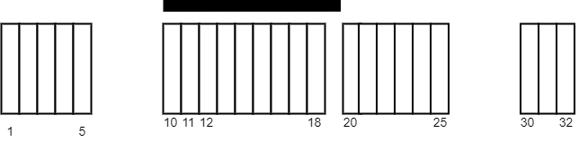
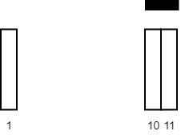

# 毯子覆盖的最多白色砖块数

给你一个二维整数数组 `tiles` ，其中 `tiles[i] = [li, ri]` ，表示所有在 `li <= j <= ri` 之间的每个瓷砖位置 `j` 都被涂成了白色。

同时给你一个整数 `carpetLen` ，表示可以放在 **任何位置** 的一块毯子。

请你返回使用这块毯子，**最多** 可以盖住多少块瓷砖。

**示例 1：**



``` javascript
输入：tiles = [[1,5],[10,11],[12,18],[20,25],[30,32]], carpetLen = 10
输出：9
解释：将毯子从瓷砖 10 开始放置。
总共覆盖 9 块瓷砖，所以返回 9 。
注意可能有其他方案也可以覆盖 9 块瓷砖。
可以看出，瓷砖无法覆盖超过 9 块瓷砖。
```

**示例 2：**



``` javascript
输入：tiles = [[10,11],[1,1]], carpetLen = 2
输出：2
解释：将毯子从瓷砖 10 开始放置。
总共覆盖 2 块瓷砖，所以我们返回 2 。
```

**提示：**

- `1 <= tiles.length <= 5 * 10^4`
- `tiles[i].length == 2`
- `1 <= li <= ri <= 10^9`
- `1 <= carpetLen <= 10^9`
- `tiles` 互相 **不会重叠** 。

**解答：**

**#**|**编程语言**|**时间（ms / %）**|**内存（MB / %）**|**代码**
--|--|--|--|--
1|javascript|?? / 100|?? / 100|[??](./javascript/ac_v1.js)

来源：力扣（LeetCode）

链接：https://leetcode.cn/problems/maximum-white-tiles-covered-by-a-carpet

著作权归领扣网络所有。商业转载请联系官方授权，非商业转载请注明出处。
