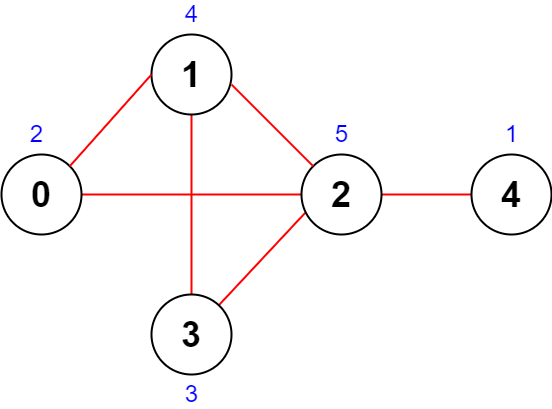

# 道路的最大总重要性

给你一个整数 `n` ，表示一个国家里的城市数目。城市编号为 `0` 到 `n - 1` 。

给你一个二维整数数组 `roads` ，其中 `roads[i] = [ai, bi]` 表示城市 `ai` 和 `bi` 之间有一条 **双向** 道路。

你需要给每个城市安排一个从 `1` 到 `n` 之间的整数值，且每个值只能被使用 **一次** 。道路的 **重要性** 定义为这条道路连接的两座城市数值 **之和** 。

请你返回在最优安排下，**所有道路重要性** 之和 **最大** 为多少。

**示例 1：**



``` javascript
输入：n = 5, roads = [[0,1],[1,2],[2,3],[0,2],[1,3],[2,4]]
输出：43
解释：上图展示了国家图和每个城市被安排的值 [2,4,5,3,1] 。
- 道路 (0,1) 重要性为 2 + 4 = 6 。
- 道路 (1,2) 重要性为 4 + 5 = 9 。
- 道路 (2,3) 重要性为 5 + 3 = 8 。
- 道路 (0,2) 重要性为 2 + 5 = 7 。
- 道路 (1,3) 重要性为 4 + 3 = 7 。
- 道路 (2,4) 重要性为 5 + 1 = 6 。
所有道路重要性之和为 6 + 9 + 8 + 7 + 7 + 6 = 43 。
可以证明，重要性之和不可能超过 43 。
```

**示例 2：**


``` javascript
输入：n = 5, roads = [[0,3],[2,4],[1,3]]
输出：20
解释：上图展示了国家图和每个城市被安排的值 [4,3,2,5,1] 。
- 道路 (0,3) 重要性为 4 + 5 = 9 。
- 道路 (2,4) 重要性为 2 + 1 = 3 。
- 道路 (1,3) 重要性为 3 + 5 = 8 。
所有道路重要性之和为 9 + 3 + 8 = 20 。
可以证明，重要性之和不可能超过 20 。
```

**提示：**

- `2 <= n <= 5 * 10^4`
- `1 <= roads.length <= 5 * 10^4`
- `roads[i].length == 2`
- `0 <= ai, bi <= n - 1`
- `ai != bi`
- 没有重复道路。

**解答：**

**#**|**编程语言**|**时间（ms / %）**|**内存（MB / %）**|**代码**
--|--|--|--|--
1|javascript|208 / 100|66.9 / 100|[贪心](./javascript/ac_v1.js)

来源：力扣（LeetCode）

链接：https://leetcode.cn/problems/maximum-total-importance-of-roads

著作权归领扣网络所有。商业转载请联系官方授权，非商业转载请注明出处。
