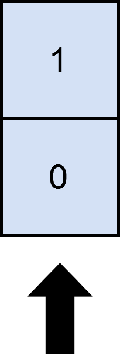

# 被列覆盖的最多行数

给你一个下标从 **0** 开始的 `m x n` 二进制矩阵 `mat` 和一个整数 `cols` ，表示你需要选出的列数。

如果一行中，所有的 `1` 都被你选中的列所覆盖，那么我们称这一行 **被覆盖** 了。

请你返回在选择 `cols` 列的情况下，**被覆盖** 的行数 **最大** 为多少。

**示例 1：**


``` javascript
输入：mat = [[0,0,0],[1,0,1],[0,1,1],[0,0,1]], cols = 2
输出：3
解释：
如上图所示，覆盖 3 行的一种可行办法是选择第 0 和第 2 列。
可以看出，不存在大于 3 行被覆盖的方案，所以我们返回 3 。
```

**示例 2：**



``` javascript
输入：mat = [[1],[0]], cols = 1
输出：2
解释：
选择唯一的一列，两行都被覆盖了，原因是整个矩阵都被覆盖了。
所以我们返回 2 。
```

**提示：**

- `m == mat.length`
- `n == mat[i].length`
- `1 <= m, n <= 12`
- `mat[i][j]` 要么是 `0` 要么是 `1` 。
- `1 <= cols <= n`

**解答：**

**#**|**编程语言**|**时间（ms / %）**|**内存（MB / %）**|**代码**
--|--|--|--|--
1|javascript|80 / 100|42.1 / 100|[位压缩](./javascript/ac_v1.js)

来源：力扣（LeetCode）

链接：https://leetcode.cn/problems/maximum-rows-covered-by-columns

著作权归领扣网络所有。商业转载请联系官方授权，非商业转载请注明出处。
