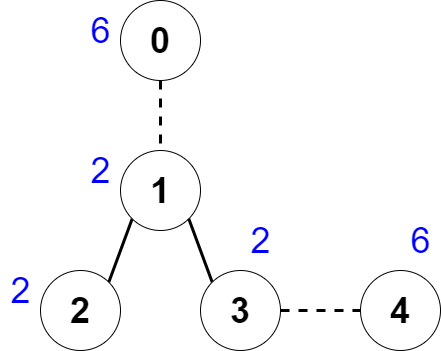

# 创建价值相同的连通块

有一棵 `n` 个节点的无向树，节点编号为 `0` 到 `n - 1` 。

给你一个长度为 `n` 下标从 **0** 开始的整数数组 `nums` ，其中 `nums[i]` 表示第 `i` 个节点的值。同时给你一个长度为 `n - 1` 的二维整数数组 `edges` ，其中 `edges[i] = [ai, bi]` 表示节点 `ai` 与 `bi` 之间有一条边。

你可以 **删除** 一些边，将这棵树分成几个连通块。一个连通块的 **价值** 定义为这个连通块中 **所有** 节点 `i` 对应的 `nums[i]` 之和。

你需要删除一些边，删除后得到的各个连通块的价值都相等。请返回你可以删除的边数 **最多** 为多少。

**示例 1：**



``` javascript
输入：nums = [6,2,2,2,6], edges = [[0,1],[1,2],[1,3],[3,4]] 
输出：2
解释：上图展示了我们可以删除边 [0,1] 和 [3,4] 。得到的连通块为 [0] ，[1,2,3] 和 [4] 。每个连通块的价值都为 6 。可以证明没有别的更好的删除方案存在了，所以答案为 2 。
```

**示例 2：**

``` javascri
pt
输入：nums = [2], edges = []
输出：0
解释：没有任何边可以删除。
```

**提示：**

- `1 <= n <= 2 * 10^4`
- `nums.length == n`
- `1 <= nums[i] <= 50`
- `edges.length == n - 1`
- `edges[i].length == 2`
- `0 <= edges[i][0], edges[i][1] <= n - 1`
- `edges` 表示一棵合法的树。

**解答：**

**#**|**编程语言**|**时间（ms / %）**|**内存（MB / %）**|**代码**
--|--|--|--|--
1|javascript|?? / ??|?? / ??|[??](./javascript/ac_v1.js)

来源：力扣（LeetCode）

链接：https://leetcode.cn/problems/create-components-with-same-value

著作权归领扣网络所有。商业转载请联系官方授权，非商业转载请注明出处。
