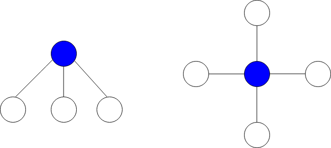

# 图中最大星和

给你一个 `n` 个点的无向图，节点从 `0` 到 `n - 1` 编号。给你一个长度为 `n` 下标从 **0** 开始的整数数组 `vals` ，其中 `vals[i]` 表示第 `i` 个节点的值。

同时给你一个二维整数数组 `edges` ，其中 `edges[i] = [ai, bi]` 表示节点 `ai` 和 `bi` 之间有一条双向边。

**星图** 是给定图中的一个子图，它包含一个中心节点和 `0` 个或更多个邻居。换言之，星图是给定图中一个边的子集，且这些边都有一个公共节点。

下图分别展示了有 `3` 个和 `4` 个邻居的星图，蓝色节点为中心节点。



**星和** 定义为星图中所有节点值的和。

给你一个整数 k ，请你返回 **至多** 包含 k 条边的星图中的 **最大星和** 。

**示例 1：**


``` javascript
输入：vals = [1,2,3,4,10,-10,-20], edges = [[0,1],[1,2],[1,3],[3,4],[3,5],[3,6]], k = 2
输出：16
解释：上图展示了输入示例。
最大星和对应的星图在上图中用蓝色标出。中心节点是 3 ，星图中还包含邻居 1 和 4 。
无法得到一个和大于 16 且边数不超过 2 的星图。
```

**示例 2：**

``` javascript
输入：vals = [-5], edges = [], k = 0
输出：-5
解释：只有一个星图，就是节点 0 自己。
所以我们返回 -5 。
```

**提示：**

- `n == vals.length`
- `1 <= n <= 10^5`
- `-10^4 <= vals[i] <= 10^4`
- `0 <= edges.length <= min(n * (n - 1) / 2, 10^5)`
- `edges[i].length == 2`
- `0 <= ai, bi <= n - 1`
- `ai != bi`
- `0 <= k <= n - 1`

**解答：**

**#**|**编程语言**|**时间（ms / %）**|**内存（MB / %）**|**代码**
--|--|--|--|--
1|javascript|336 / 48.98|82.8 / 51.02|[朴素方法](./javascript/ac_v1.js)

来源：力扣（LeetCode）

链接：https://leetcode.cn/problems/maximum-star-sum-of-a-graph

著作权归领扣网络所有。商业转载请联系官方授权，非商业转载请注明出处。
