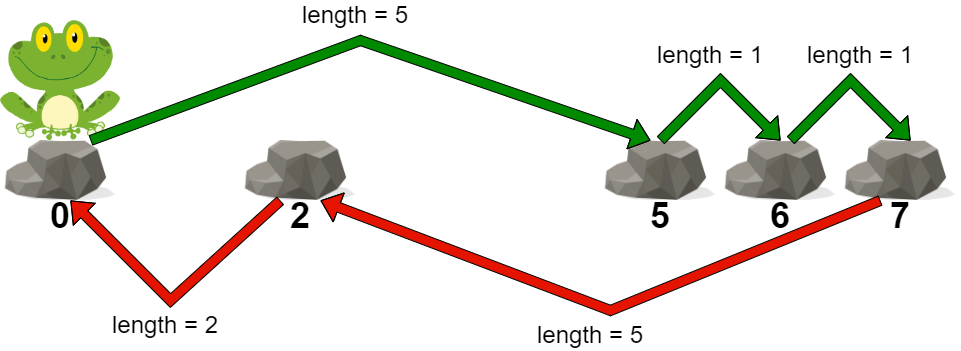

# 青蛙过河 II

给你一个下标从 **0** 开始的整数数组 `stones` ，数组中的元素 **严格递增** ，表示一条河中石头的位置。

一只青蛙一开始在第一块石头上，它想到达最后一块石头，然后回到第一块石头。同时每块石头 **至多** 到达 **一次**。

一次跳跃的 **长度** 是青蛙跳跃前和跳跃后所在两块石头之间的距离。

- 更正式的，如果青蛙从 `stones[i]` 跳到 `stones[j]` ，跳跃的长度为 `|stones[i] - stones[j]|` 。

一条路径的 **代价** 是这条路径里的 **最大跳跃长度** 。

请你返回这只青蛙的 **最小代价** 。

**示例 1：**



``` javascript
输入：stones = [0,2,5,6,7]
输出：5
解释：上图展示了一条最优路径。
这条路径的代价是 5 ，是这条路径中的最大跳跃长度。
无法得到一条代价小于 5 的路径，我们返回 5 。
```

**示例 2：**


``` javascript
输入：stones = [0,3,9]
输出：9
解释：
青蛙可以直接跳到最后一块石头，然后跳回第一块石头。
在这条路径中，每次跳跃长度都是 9 。所以路径代价是 max(9, 9) = 9 。
这是可行路径中的最小代价。
```

**提示：**

- `2 <= stones.length <= 10^5`
- `0 <= stones[i] <= 10^9`
- `stones[0] == 0`
- `stones` 中的元素严格递增。

**解答：**

**#**|**编程语言**|**时间（ms / %）**|**内存（MB / %）**|**代码**
--|--|--|--|--
1|javascript|84 / 28.57|51.4 / 54.76|[贪心](./javascript/ac_v1.js)

来源：力扣（LeetCode）

链接：https://leetcode.cn/problems/frog-jump-ii

著作权归领扣网络所有。商业转载请联系官方授权，非商业转载请注明出处。
