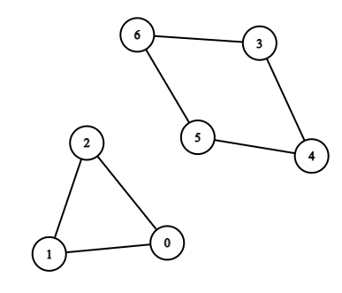

# 图中的最短环

现有一个含 `n` 个顶点的 **双向** 图，每个顶点按从 `0` 到 `n - 1` 标记。图中的边由二维整数数组 `edges` 表示，其中 `edges[i] = [ui, vi]` 表示顶点 `ui` 和 `vi` 之间存在一条边。每对顶点最多通过一条边连接，并且不存在与自身相连的顶点。

返回图中 **最短** 环的长度。如果不存在环，则返回 `-1` 。

**环** 是指以同一节点开始和结束，并且路径中的每条边仅使用一次。

**示例 1：**



``` javascript
输入：n = 7, edges = [[0,1],[1,2],[2,0],[3,4],[4,5],[5,6],[6,3]]
输出：3
解释：长度最小的循环是：0 -> 1 -> 2 -> 0
```

**示例 2：**


``` javascript
输入：n = 4, edges = [[0,1],[0,2]]
输出：-1
解释：图中不存在循环
```

**提示：**

- `2 <= n <= 1000`
- `1 <= edges.length <= 1000`
- `edges[i].length == 2`
- `0 <= ui, vi < n`
- `ui != vi`
- 不存在重复的边

**解答：**

**#**|**编程语言**|**时间（ms / %）**|**内存（MB / %）**|**代码**
--|--|--|--|--
1|javascript|?? / ??|?? / ??|[??](./javascript/ac_v1.js)

来源：力扣（LeetCode）

链接：https://leetcode.cn/problems/shortest-cycle-in-a-graph

著作权归领扣网络所有。商业转载请联系官方授权，非商业转载请注明出处。
