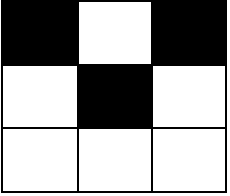

# 黑格子的数目

给你两个整数 `m` 和 `n` ，表示一个下标从 **0** 开始的 `m x n` 的网格图。

给你一个下标从 **0** 开始的二维整数矩阵 `coordinates` ，其中 `coordinates[i] = [x, y]` 表示坐标为 `[x, y]` 的格子是 **黑色的** ，所有没出现在 `coordinates` 中的格子都是 **白色的**。

一个块定义为网格图中 `2 x 2` 的一个子矩阵。更正式的，对于左上角格子为 `[x, y]` 的块，其中 `0 <= x < m - 1` 且 `0 <= y < n - 1` ，包含坐标为 `[x, y]` ，`[x + 1, y]` ，`[x, y + 1]` 和 `[x + 1, y + 1]` 的格子。

请你返回一个下标从 **0** 开始长度为 `5` 的整数数组 `arr` ，`arr[i]` 表示恰好包含 `i` 个 **黑色** 格子的块的数目。

**示例 1：**

``` javascript
输入：m = 3, n = 3, coordinates = [[0,0]]
输出：[3,1,0,0,0]
解释：网格图如下：
```


``` javascript
只有 1 个块有一个黑色格子，这个块是左上角为 [0,0] 的块。
其他 3 个左上角分别为 [0,1] ，[1,0] 和 [1,1] 的块都有 0 个黑格子。
所以我们返回 [3,1,0,0,0] 。
```

**示例 2：**

``` javascript
输入：m = 3, n = 3, coordinates = [[0,0],[1,1],[0,2]]
输出：[0,2,2,0,0]
解释：网格图如下：
```



``` javascript
有 2 个块有 2 个黑色格子（左上角格子分别为 [0,0] 和 [0,1]）。
左上角为 [1,0] 和 [1,1] 的两个块，都有 1 个黑格子。
所以我们返回 [0,2,2,0,0] 。
```

**提示：**

- `2 <= m <= 10^5`
- `2 <= n <= 10^5`
- `0 <= coordinates.length <= 10^4`
- `coordinates[i].length == 2`
- `0 <= coordinates[i][0] < m`
- `0 <= coordinates[i][1] < n`
- `coordinates` 中的坐标对两两互不相同。

**解答：**

**#**|**编程语言**|**时间（ms / %）**|**内存（MB / %）**|**代码**
--|--|--|--|--
1|javascript|?? / ??|?? / ??|[??](./javascript/ac_v1.js)

来源：力扣（LeetCode）

链接：https://leetcode.cn/problems/count-zero-request-servers

著作权归领扣网络所有。商业转载请联系官方授权，非商业转载请注明出处。
