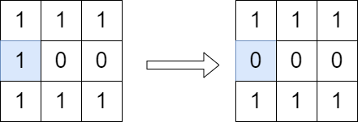

# 二进制矩阵中翻转最多一次使路径不连通

给你一个下标从 **0** 开始的 `m x n` **二进制** 矩阵 `grid` 。你可以从一个格子 `(row, col)` 移动到格子 `(row + 1, col)` 或者 `(row, col + 1)` ，前提是前往的格子值为 `1` 。如果从 `(0, 0)` 到 `(m - 1, n - 1)` 没有任何路径，我们称该矩阵是 **不连通** 的。

你可以翻转 **最多一个** 格子的值（也可以不翻转）。你 **不能翻转** 格子 `(0, 0)` 和 `(m - 1, n - 1)` 。

如果可以使矩阵不连通，请你返回 `true` ，否则返回 `false` 。

**注意** ，翻转一个格子的值，可以使它的值从 `0` 变 `1` ，或从 `1` 变 `0` 。

**示例 1：**



``` javascript
输入：grid = [[1,1,1],[1,0,0],[1,1,1]]
输出：true
解释：按照上图所示我们翻转蓝色格子里的值，翻转后从 (0, 0) 到 (2, 2) 没有路径。
```

**示例 2：**


``` javascript
输入：grid = [[1,1,1],[1,0,1],[1,1,1]]
输出：false
解释：无法翻转至多一个格子，使 (0, 0) 到 (2, 2) 没有路径。
```

**提示：**

- `m == grid.length`
- `n == grid[i].length`
- `1 <= m, n <= 1000`
- `1 <= m * n <= 10^5`
- `grid[0][0] == grid[m - 1][n - 1] == 1`

**解答：**

**#**|**编程语言**|**时间（ms / %）**|**内存（MB / %）**|**代码**
--|--|--|--|--
1|javascript|?? / ??|?? / ??|[??](./javascript/ac_v1.js)

来源：力扣（LeetCode）

链接：https://leetcode.cn/problems/disconnect-path-in-a-binary-matrix-by-at-most-one-flip

著作权归领扣网络所有。商业转载请联系官方授权，非商业转载请注明出处。
