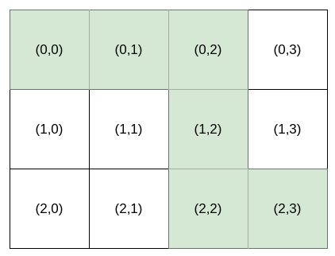

# 第 K 条最小指令

Bob 站在单元格 (0, 0) ，想要前往目的地 destination ：(row, column) 。他只能向 **右** 或向 **下** 走。你可以为 Bob 提供导航 **指令** 来帮助他到达目的地 destination 。

指令 用字符串表示，其中每个字符：

- 'H' ，意味着水平向右移动
- 'V' ，意味着竖直向下移动

能够为 Bob 导航到目的地 destination 的指令可以有多种，例如，如果目的地 destination 是 (2, 3)，"HHHVV" 和 "HVHVH" 都是有效 **指令**。

然而，Bob 很挑剔。因为他的幸运数字是 k，他想要遵循 **按字典序排列后的第 k 条最小指令** 的导航前往目的地 destination 。k 的编号 **从 1 开始**。

给你一个整数数组 destination 和一个整数 k ，请你返回可以为 Bob 提供前往目的地 destination 导航的 **按字典序排列后的第 k 条最小指令**。

**示例 1：**


``` javascript
输入：destination = [2,3], k = 1
输出："HHHVV"
解释：能前往 (2, 3) 的所有导航指令 按字典序排列后 如下所示：
["HHHVV", "HHVHV", "HHVVH", "HVHHV", "HVHVH", "HVVHH", "VHHHV", "VHHVH", "VHVHH", "VVHHH"].
```

**示例 2：**


``` javascript
输入：destination = [2,3], k = 2
输出："HHVHV"
```

**示例 3：**



``` javascript
输入：destination = [2,3], k = 3
输出："HHVVH"
```

**提示：**

- destination.length == 2
- 1 <= row, column <= 15
- 1 <= k <= nCr(row + column, row)，其中 nCr(a, b) 表示组合数，即从 a 个物品中选 b 个物品的不同方案数。

**解答：**

**#**|**编程语言**|**时间（ms / %）**|**内存（MB / %）**|**代码**
--|--|--|--|--
1|javascript|?? / 100|?? / 100|[??](./javascript/ac_v1.js)

来源：力扣（LeetCode）

链接：https://leetcode-cn.com/problems/kth-smallest-instructions

著作权归领扣网络所有。商业转载请联系官方授权，非商业转载请注明出处。
