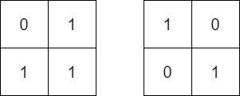

# 判断矩阵经轮转后是否一致

给你两个大小为 n x n 的二进制矩阵 mat 和 target 。现 **以 90 度顺时针轮转** 矩阵 mat 中的元素 **若干次**，如果能够使 mat 与 target 一致，返回 true ；否则，返回 false 。

**示例 1：**


``` javascript
输入：mat = [[0,1],[1,0]], target = [[1,0],[0,1]]
输出：true
解释：顺时针轮转 90 度一次可以使 mat 和 target 一致。
```

**示例 2：**



``` javascript
输入：mat = [[0,1],[1,1]], target = [[1,0],[0,1]]
输出：false
解释：无法通过轮转矩阵中的元素使 equal 与 target 一致。
```

**示例 3：**


``` javascript
输入：mat = [[0,0,0],[0,1,0],[1,1,1]], target = [[1,1,1],[0,1,0],[0,0,0]]
输出：true
解释：顺时针轮转 90 度两次可以使 mat 和 target 一致。
```

**提示：**

- n == mat.length == target.length
- n == mat[i].length == target[i].length
- 1 <= n <= 10
- mat[i][j] 和 target[i][j] 不是 0 就是 1

**解答：**

**#**|**编程语言**|**时间（ms / %）**|**内存（MB / %）**|**代码**
--|--|--|--|--
1|javascript|80 / 100|38 / 100|[朴素方法](./javascript/ac_v1.js)

来源：力扣（LeetCode）

链接：https://leetcode-cn.com/problems/determine-whether-matrix-can-be-obtained-by-rotation

著作权归领扣网络所有。商业转载请联系官方授权，非商业转载请注明出处。
