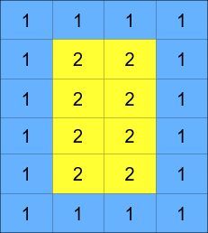

# 循环轮转矩阵

给你一个大小为 m x n 的整数矩阵 grid​​​ ，其中 m 和 n 都是 **偶数**；另给你一个整数 k 。

矩阵由若干层组成，如下图所示，每种颜色代表一层：



矩阵的循环轮转是通过分别循环轮转矩阵中的每一层完成的。在对某一层进行一次循环旋转操作时，层中的每一个元素将会取代其 **逆时针** 方向的相邻元素。轮转示例如下：


返回执行 k 次循环轮转操作后的矩阵。

**示例 1：**


``` javascript
输入：grid = [[40,10],[30,20]], k = 1
输出：[[10,20],[40,30]]
解释：上图展示了矩阵在执行循环轮转操作时每一步的状态。
```

**示例 2：**


``` javascript
输入：grid = [[1,2,3,4],[5,6,7,8],[9,10,11,12],[13,14,15,16]], k = 2
输出：[[3,4,8,12],[2,11,10,16],[1,7,6,15],[5,9,13,14]]
解释：上图展示了矩阵在执行循环轮转操作时每一步的状态。
```

**提示：**

- m == grid.length
- n == grid[i].length
- 2 <= m, n <= 50
- m 和 n 都是 **偶数**
- 1 <= grid[i][j] <= 5000
- 1 <= k <= 1e9

**解答：**

**#**|**编程语言**|**时间（ms / %）**|**内存（MB / %）**|**代码**
--|--|--|--|--
1|javascript|116 / 100|42.2 / 100|[朴素方法](./javascript/ac_v1.js)

来源：力扣（LeetCode）

链接：https://leetcode-cn.com/problems/cyclically-rotating-a-grid

著作权归领扣网络所有。商业转载请联系官方授权，非商业转载请注明出处。
