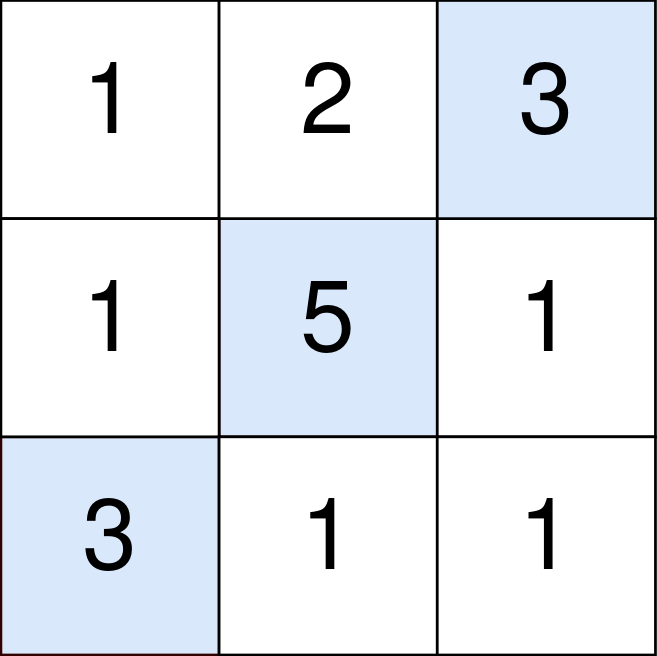
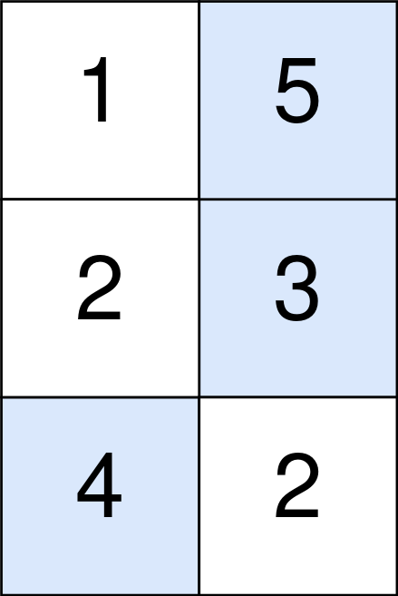

# 扣分后的最大得分

给你一个 m x n 的整数矩阵 points （下标从 **0** 开始）。一开始你的得分为 0 ，你想最大化从矩阵中得到的分数。

你的得分方式为：**每一行** 中选取一个格子，选中坐标为 (r, c) 的格子会给你的总得分 **增加** points[r][c] 。

然而，相邻行之间被选中的格子如果隔得太远，你会失去一些得分。对于相邻行 r 和 r + 1 （其中 0 <= r < m - 1），选中坐标为 (r, c1) 和 (r + 1, c2) 的格子，你的总得分 **减少** abs(c1 - c2) 。

请你返回你能得到的 **最大** 得分。

abs(x) 定义为：

- 如果 x >= 0 ，那么值为 x 。
- 如果 x < 0 ，那么值为 -x 。

**示例 1：**



``` javascript
输入：points = [[1,2,3],[1,5,1],[3,1,1]]
输出：9
解释：
蓝色格子是最优方案选中的格子，坐标分别为 (0, 2)，(1, 1) 和 (2, 0) 。
你的总得分增加 3 + 5 + 3 = 11 。
但是你的总得分需要扣除 abs(2 - 1) + abs(1 - 0) = 2 。
你的最终得分为 11 - 2 = 9 。
```

**示例 2：**



``` javascript
输入：points = [[1,5],[2,3],[4,2]]
输出：11
解释：
蓝色格子是最优方案选中的格子，坐标分别为 (0, 1)，(1, 1) 和 (2, 0) 。
你的总得分增加 5 + 3 + 4 = 12 。
但是你的总得分需要扣除 abs(1 - 1) + abs(1 - 0) = 1 。
你的最终得分为 12 - 1 = 11 。
```

**提示：**

- m == points.length
- n == points[r].length
- 1 <= m, n <= 1e5
- 1 <= m * n <= 1e5
- 0 <= points[r][c] <= 1e5

**解答：**

**#**|**编程语言**|**时间（ms / %）**|**内存（MB / %）**|**代码**
--|--|--|--|--
1|javascript|?? / 100|?? / 100|[??](./javascript/ac_v1.js)

来源：力扣（LeetCode）

链接：https://leetcode-cn.com/problems/maximum-number-of-points-with-cost

著作权归领扣网络所有。商业转载请联系官方授权，非商业转载请注明出处。
