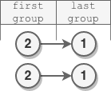

# 反转偶数长度组的节点

给你一个链表的头节点 `head` 。

链表中的节点 **按顺序** 划分成若干 **非空** 组，这些非空组的长度构成一个自然数序列（`1, 2, 3, 4, ...`）。一个组的 **长度** 就是组中分配到的节点数目。换句话说：

- 节点 `1` 分配给第一组
- 节点 `2` 和 `3` 分配给第二组
- 节点 `4`、`5` 和 `6` 分配给第三组，以此类推

注意，最后一组的长度可能小于或者等于 `1 + 倒数第二组的长度` 。

**反转** 每个 **偶数** 长度组中的节点，并返回修改后链表的头节点 `head` 。

**示例 1：**


``` javascript
输入：head = [5,2,6,3,9,1,7,3,8,4]
输出：[5,6,2,3,9,1,4,8,3,7]
解释：
- 第一组长度为 1 ，奇数，没有发生反转。
- 第二组长度为 2 ，偶数，节点反转。
- 第三组长度为 3 ，奇数，没有发生反转。
- 最后一组长度为 4 ，偶数，节点反转。
```

**示例 2：**


``` javascript
输入：head = [1,1,0,6]
输出：[1,0,1,6]
解释：
- 第一组长度为 1 ，没有发生反转。
- 第二组长度为 2 ，节点反转。
- 最后一组长度为 1 ，没有发生反转。
```

**示例 3：**



``` javascript
输入：head = [2,1]
输出：[2,1]
解释：
- 第一组长度为 1 ，没有发生反转。
- 最后一组长度为 1 ，没有发生反转。
```

**示例 4：**

``` javascript
输入：head = [8]
输出：[8]
解释：只有一个长度为 1 的组，没有发生反转。
```

**提示：**

- 链表中节点数目范围是 `[1, 1e5]`
- `0 <= Node.val <= 1e5`

**解答：**

**#**|**编程语言**|**时间（ms / %）**|**内存（MB / %）**|**代码**
--|--|--|--|--
1|javascript|732 / 100|78.1 / 100|[朴素方法](./javascript/ac_v1.js)

来源：力扣（LeetCode）

链接：https://leetcode-cn.com/problems/reverse-nodes-in-even-length-groups

著作权归领扣网络所有。商业转载请联系官方授权，非商业转载请注明出处。
