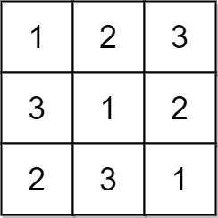
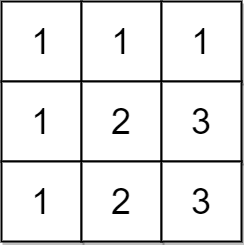

# 检查是否每一行每一列都包含全部整数

对一个大小为 `n x n` 的矩阵而言，如果其每一行和每一列都包含从 `1` 到 `n` 的 **全部** 整数（含 `1` 和 `n`），则认为该矩阵是一个 **有效** 矩阵。

给你一个大小为 `n x n` 的整数矩阵 `matrix` ，请你判断矩阵是否为一个有效矩阵：如果是，返回 `true` ；否则，返回 `false` 。

**示例 1：**



``` javascript
输入：matrix = [[1,2,3],[3,1,2],[2,3,1]]
输出：true
解释：在此例中，n = 3 ，每一行和每一列都包含数字 1、2、3 。
因此，返回 true 。
```

**示例 2：**



``` javascript
输入：matrix = [[1,1,1],[1,2,3],[1,2,3]]
输出：false
解释：在此例中，n = 3 ，但第一行和第一列不包含数字 2 和 3 。
因此，返回 false 。
```

**提示：**

- `n == matrix.length == matrix[i].length`
- `1 <= n <= 100`
- `1 <= matrix[i][j] <= n`

**解答：**

**#**|**编程语言**|**时间（ms / %）**|**内存（MB / %）**|**代码**
--|--|--|--|--
1|javascript|92 / 100|45.4 / 100|[朴素方法](./javascript/ac_v1.js)

来源：力扣（LeetCode）

链接：https://leetcode-cn.com/problems/check-if-every-row-and-column-contains-all-numbers

著作权归领扣网络所有。商业转载请联系官方授权，非商业转载请注明出处。
