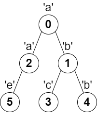
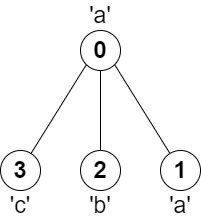

# 转角路径的乘积中最多能有几个尾随零

给你一棵 **树**（即一个连通、无向、无环图），根节点是节点 `0` ，这棵树由编号从 `0` 到 `n - 1` 的 `n` 个节点组成。用下标从 **0** 开始、长度为 `n` 的数组 `parent` 来表示这棵树，其中 `parent[i]` 是节点 `i` 的父节点，由于节点 `0` 是根节点，所以 `parent[0] == -1` 。

另给你一个字符串 `s` ，长度也是 `n` ，其中 `s[i]` 表示分配给节点 `i` 的字符。

请你找出路径上任意一对相邻节点都没有分配到相同字符的 **最长路径** ，并返回该路径的长度。

**示例 1：**



``` javascript
输入：parent = [-1,0,0,1,1,2], s = "abacbe"
输出：3
解释：任意一对相邻节点字符都不同的最长路径是：0 -> 1 -> 3 。该路径的长度是 3 ，所以返回 3 。
可以证明不存在满足上述条件且比 3 更长的路径。
```

**示例 2：**



``` javascript
输入：parent = [-1,0,0,0], s = "aabc"
输出：3
解释：任意一对相邻节点字符都不同的最长路径是：2 -> 0 -> 3 。该路径的长度为 3 ，所以返回 3 。
```

**提示：**

- `n == parent.length == s.length`
- `1 <= n <= 10^5`
- 对所有 `i >= 1` ，`0 <= parent[i] <= n - 1` 均成立
- `parent[0] == -1`
- `parent` 表示一棵有效的树
- `s` 仅由小写英文字母组成

**解答：**

**#**|**编程语言**|**时间（ms / %）**|**内存（MB / %）**|**代码**
--|--|--|--|--
1|javascript|?? / 100|?? / 100|[??](./javascript/ac_v1.js)

来源：力扣（LeetCode）

链接：https://leetcode-cn.com/problems/longest-path-with-different-adjacent-characters

著作权归领扣网络所有。商业转载请联系官方授权，非商业转载请注明出处。
