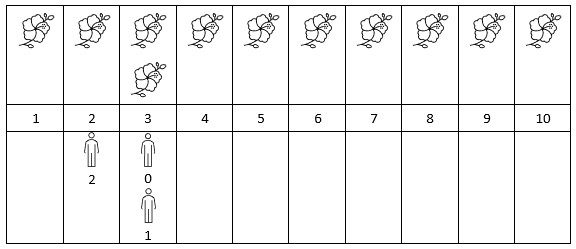

# 花期内花的数目

给你一个下标从 **0** 开始的二维整数数组 `flowers` ，其中 `flowers[i] = [starti, endi]` 表示第 `i` 朵花的 **花期** 从 `starti` 到 `endi` （都 **包含**）。同时给你一个下标从 **0** 开始大小为 `n` 的整数数组 `persons` ，`persons[i]` 是第 `i` 个人来看花的时间。

请你返回一个大小为 `n` 的整数数组 `answer` ，其中 `answer[i]` 是第 `i` 个人到达时在花期内花的 **数目** 。

**示例 1：**


``` javascript
输入：flowers = [[1,6],[3,7],[9,12],[4,13]], persons = [2,3,7,11]
输出：[1,2,2,2]
解释：上图展示了每朵花的花期时间，和每个人的到达时间。
对每个人，我们返回他们到达时在花期内花的数目。
```

**示例 2：**



``` javascript
输入：flowers = [[1,10],[3,3]], persons = [3,3,2]
输出：[2,2,1]
解释：上图展示了每朵花的花期时间，和每个人的到达时间。
对每个人，我们返回他们到达时在花期内花的数目。
```

**提示：**

- `1 <= flowers.length <= 5 * 10^4`
- `flowers[i].length == 2`
- `1 <= starti <= endi <= 10^9`
- `1 <= persons.length <= 5 * 10^4`
- `1 <= persons[i] <= 10^9`

**解答：**

**#**|**编程语言**|**时间（ms / %）**|**内存（MB / %）**|**代码**
--|--|--|--|--
1|javascript|?? / 100|?? / 100|[??](./javascript/ac_v1.js)

来源：力扣（LeetCode）

链接：https://leetcode.cn/problems/number-of-flowers-in-full-bloom

著作权归领扣网络所有。商业转载请联系官方授权，非商业转载请注明出处。
