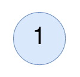

# 统计值等于子树平均值的节点数

给你一棵二叉树的根节点 `root` ，找出并返回满足要求的节点数，要求节点的值等于其 **子树** 中值的 **平均值** 。

**注意：**

- `n` 个元素的平均值可以由 `n` 个元素 **求和** 然后再除以 `n` ，并 **向下舍入** 到最近的整数。
- `root` 的 **子树** 由 `root` 和它的所有后代组成。

**示例 1：**


``` javascript
输入：root = [4,8,5,0,1,null,6]
输出：5
解释：
对值为 4 的节点：子树的平均值 (4 + 8 + 5 + 0 + 1 + 6) / 6 = 24 / 6 = 4 。
对值为 5 的节点：子树的平均值 (5 + 6) / 2 = 11 / 2 = 5 。
对值为 0 的节点：子树的平均值 0 / 1 = 0 。
对值为 1 的节点：子树的平均值 1 / 1 = 1 。
对值为 6 的节点：子树的平均值 6 / 1 = 6 。
```

**示例 2：**



``` javascript
输入：root = [1]
输出：1
解释：对值为 1 的节点：子树的平均值 1 / 1 = 1。
```

**提示：**

- 树中节点数目在范围 `[1, 1000]` 内
- `0 <= Node.val <= 1000`

**解答：**

**#**|**编程语言**|**时间（ms / %）**|**内存（MB / %）**|**代码**
--|--|--|--|--
1|javascript|72 / 100|45.4 / 100|[后序遍历](./javascript/ac_v1.js)

来源：力扣（LeetCode）

链接：https://leetcode-cn.com/problems/count-nodes-equal-to-average-of-subtree

著作权归领扣网络所有。商业转载请联系官方授权，非商业转载请注明出处。
