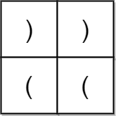

# 检查是否有合法括号字符串路径

一个括号字符串是一个 **非空** 且只包含 `'('` 和 `')'` 的字符串。如果下面 **任意** 条件为 **真** ，那么这个括号字符串就是 **合法的** 。

- 字符串是 `()` 。
- 字符串可以表示为 `AB`（`A` 连接 `B`），`A` 和 `B` 都是合法括号序列。
- 字符串可以表示为 `(A)` ，其中 `A` 是合法括号序列。

给你一个 `m x n` 的括号网格图矩阵 `grid` 。网格图中一个 **合法括号路径** 是满足以下所有条件的一条路径：

- 路径开始于左上角格子 `(0, 0)` 。
- 路径结束于右下角格子 `(m - 1, n - 1)` 。
- 路径每次只会向 **下** 或者向 **右** 移动。
- 路径经过的格子组成的括号字符串是 **合法** 的。

如果网格图中存在一条 **合法括号路径** ，请返回 `true` ，否则返回 `false` 。

**示例 1：**


``` javascript
输入：grid = [["(","(","("],[")","(",")"],["(","(",")"],["(","(",")"]]
输出：true
解释：上图展示了两条路径，它们都是合法括号字符串路径。
第一条路径得到的合法字符串是 "()(())" 。
第二条路径得到的合法字符串是 "((()))" 。
注意可能有其他的合法括号字符串路径。
```

**示例 2：**



``` javascript
输入：grid = [[")",")"],["(","("]]
输出：false
解释：两条可行路径分别得到 "))(" 和 ")((" 。由于它们都不是合法括号字符串，我们返回 false 。
```

**提示：**

- `m == grid.length`
- `n == grid[i].length`
- `1 <= m, n <= 100`
- `grid[i][j]` 要么是 `'('` ，要么是 `')'` 。

**解答：**

**#**|**编程语言**|**时间（ms / %）**|**内存（MB / %）**|**代码**
--|--|--|--|--
1|javascript|?? / 100|?? / 100|[??](./javascript/ac_v1.js)

来源：力扣（LeetCode）

链接：https://leetcode-cn.com/problems/check-if-there-is-a-valid-parentheses-string-path

著作权归领扣网络所有。商业转载请联系官方授权，非商业转载请注明出处。
