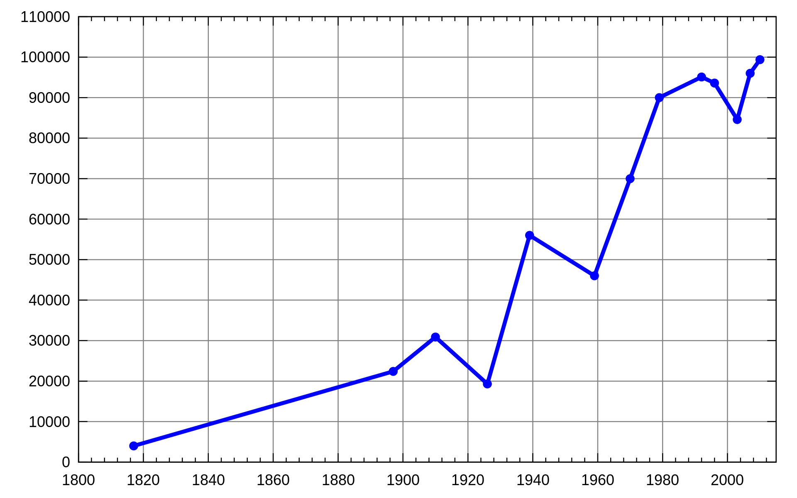

# 表示一个折线图的最少线段数

给你一个二维整数数组 `stockPrices` ，其中 `stockPrices[i] = [dayi, pricei]` 表示股票在 `dayi` 的价格为 `pricei` 。**折线图** 是一个二维平面上的若干个点组成的图，横坐标表示日期，纵坐标表示价格，折线图由相邻的点连接而成。比方说下图是一个例子：



请你返回要表示一个折线图所需要的 **最少线段数** 。

**示例 1：**


``` javascript
输入：stockPrices = [[1,7],[2,6],[3,5],[4,4],[5,4],[6,3],[7,2],[8,1]]
输出：3
解释：
上图为输入对应的图，横坐标表示日期，纵坐标表示价格。
以下 3 个线段可以表示折线图：
- 线段 1 （红色）从 (1,7) 到 (4,4) ，经过 (1,7) ，(2,6) ，(3,5) 和 (4,4) 。
- 线段 2 （蓝色）从 (4,4) 到 (5,4) 。
- 线段 3 （绿色）从 (5,4) 到 (8,1) ，经过 (5,4) ，(6,3) ，(7,2) 和 (8,1) 。
可以证明，无法用少于 3 条线段表示这个折线图。
```

**示例 2：**


``` javascript
输入：stockPrices = [[3,4],[1,2],[7,8],[2,3]]
输出：1
解释：
如上图所示，折线图可以用一条线段表示。
```

**提示：**

- `1 <= stockPrices.length <= 10^5`
- `stockPrices[i].length == 2`
- `1 <= dayi, pricei <= 10^9`
- 所有 `dayi` **互不相同** 。

**解答：**

**#**|**编程语言**|**时间（ms / %）**|**内存（MB / %）**|**代码**
--|--|--|--|--
1|javascript|188 / 100|84 / 100|[按位统计](./javascript/ac_v1.js)

来源：力扣（LeetCode）

链接：https://leetcode.cn/problems/minimum-lines-to-represent-a-line-chart

著作权归领扣网络所有。商业转载请联系官方授权，非商业转载请注明出处。
