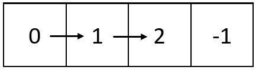

# 螺旋矩阵 IV

给你两个整数：`m` 和 `n` ，表示矩阵的维数。

另给你一个整数链表的头节点 `head` 。

请你生成一个大小为 `m x n` 的螺旋矩阵，矩阵包含链表中的所有整数。链表中的整数从矩阵 **左上角** 开始、**顺时针** 按 **螺旋** 顺序填充。如果还存在剩余的空格，则用 `-1` 填充。

返回生成的矩阵。

**示例 1：**


``` javascript
输入：m = 3, n = 5, head = [3,0,2,6,8,1,7,9,4,2,5,5,0]
输出：[[3,0,2,6,8],[5,0,-1,-1,1],[5,2,4,9,7]]
解释：上图展示了链表中的整数在矩阵中是如何排布的。
注意，矩阵中剩下的空格用 -1 填充。
```

**示例 2：**



``` javascript
输入：m = 1, n = 4, head = [0,1,2]
输出：[[0,1,2,-1]]
解释：上图展示了链表中的整数在矩阵中是如何从左到右排布的。 
注意，矩阵中剩下的空格用 -1 填充。
```

**提示：**

- `1 <= m, n <= 10^5`
- `1 <= m * n <= 10^5`
- 链表中节点数目在范围 `[1, m * n]` 内
- `0 <= Node.val <= 1000`

**解答：**

**#**|**编程语言**|**时间（ms / %）**|**内存（MB / %）**|**代码**
--|--|--|--|--
1|javascript|520 / 100|80.9 / 100|[朴素方法](./javascript/ac_v1.js)

来源：力扣（LeetCode）

链接：https://leetcode.cn/problems/spiral-matrix-iv

著作权归领扣网络所有。商业转载请联系官方授权，非商业转载请注明出处。
