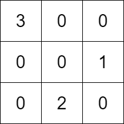

# 给定条件下构造矩阵

给你一个 **正** 整数 `k` ，同时给你：

- 一个大小为 `n` 的二维整数数组 `rowConditions` ，其中 `rowConditions[i] = [abovei, belowi]` 和
- 一个大小为 `m` 的二维整数数组 `colConditions` ，其中 `colConditions[i] = [lefti, righti]` 。

两个数组里的整数都是 `1` 到 `k` 之间的数字。

你需要构造一个 `k x k` 的矩阵，`1` 到 `k` 每个数字需要 **恰好出现一次** 。剩余的数字都是 `0` 。

矩阵还需要满足以下条件：

- 对于所有 `0` 到 `n - 1` 之间的下标 `i` ，数字 `abovei` 所在的 **行** 必须在数字 `belowi` 所在行的上面。
- 对于所有 `0` 到 `m - 1` 之间的下标 `i` ，数字 `lefti` 所在的 **列** 必须在数字 ```` 所在列的左边。

返回满足上述要求的 **任意** 矩阵。如果不存在答案，返回一个空的矩阵。

**示例 1：**



``` javascript
输入：k = 3, rowConditions = [[1,2],[3,2]], colConditions = [[2,1],[3,2]]
输出：[[3,0,0],[0,0,1],[0,2,0]]
解释：上图为一个符合所有条件的矩阵。
行要求如下：
- 数字 1 在第 1 行，数字 2 在第 2 行，1 在 2 的上面。
- 数字 3 在第 0 行，数字 2 在第 2 行，3 在 2 的上面。
列要求如下：
- 数字 2 在第 1 列，数字 1 在第 2 列，2 在 1 的左边。
- 数字 3 在第 0 列，数字 2 在第 1 列，3 在 2 的左边。
注意，可能有多种正确的答案。
```

**示例 2：**

``` javascript
输入：k = 3, rowConditions = [[1,2],[2,3],[3,1],[2,3]], colConditions = [[2,1]]
输出：[]
解释：由前两个条件可以得到 3 在 1 的下面，但第三个条件是 3 在 1 的上面。
没有符合条件的矩阵存在，所以我们返回空矩阵。
```

**提示：**

- `2 <= k <= 400`
- `1 <= rowConditions.length, colConditions.length <= 10^4`
- `rowConditions[i].length == colConditions[i].length == 2`
- `1 <= abovei, belowi, lefti, righti <= k`
- `abovei != belowi`
- `lefti != righti`

**解答：**

**#**|**编程语言**|**时间（ms / %）**|**内存（MB / %）**|**代码**
--|--|--|--|--
1|javascript|?? / 100|?? / 100|[拓扑排序](./javascript/ac_v1.js)

来源：力扣（LeetCode）

链接：https://leetcode.cn/problems/build-a-matrix-with-conditions

著作权归领扣网络所有。商业转载请联系官方授权，非商业转载请注明出处。
