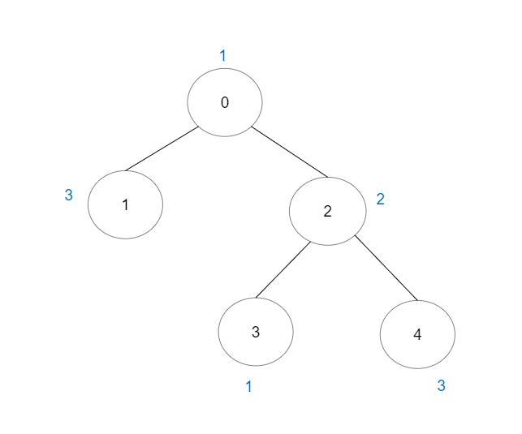
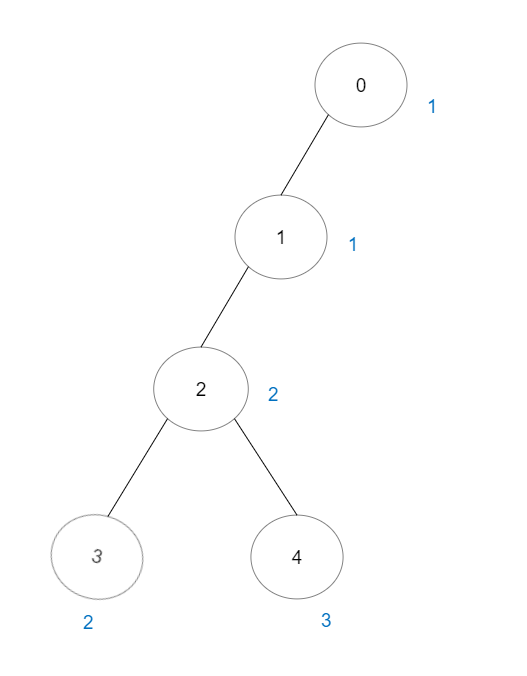

# 好路径的数目

给你一棵 `n` 个节点的树（连通无向无环的图），节点编号从 `0` 到 `n - 1` 且恰好有 `n - 1` 条边。

给你一个长度为 `n` 下标从 **0** 开始的整数数组 `vals` ，分别表示每个节点的值。同时给你一个二维整数数组 `edges` ，其中 `edges[i] = [ai, bi]` 表示节点 `ai` 和 `bi` 之间有一条 **无向** 边。

一条 **好路径** 需要满足以下条件：

- 开始节点和结束节点的值 **相同** 。
- 开始节点和结束节点中间的所有节点值都 **小于等于** 开始节点的值（也就是说开始节点的值应该是路径上所有节点的最大值）。

请你返回不同好路径的数目。

注意，一条路径和它反向的路径算作 **同一** 路径。比方说， `0 -> 1` 与 `1 -> 0` 视为同一条路径。单个节点也视为一条合法路径。

**示例 1：**



``` javascript
输入：vals = [1,3,2,1,3], edges = [[0,1],[0,2],[2,3],[2,4]]
输出：6
解释：总共有 5 条单个节点的好路径。
还有 1 条好路径：1 -> 0 -> 2 -> 4 。
（反方向的路径 4 -> 2 -> 0 -> 1 视为跟 1 -> 0 -> 2 -> 4 一样的路径）
注意 0 -> 2 -> 3 不是一条好路径，因为 vals[2] > vals[0] 。
```

**示例 2：**



``` javascript
输入：vals = [1,1,2,2,3], edges = [[0,1],[1,2],[2,3],[2,4]]
输出：7
解释：总共有 5 条单个节点的好路径。
还有 2 条好路径：0 -> 1 和 2 -> 3 。
```

**示例 3：**


``` javascript
输入：vals = [1], edges = []
输出：1
解释：这棵树只有一个节点，所以只有一条好路径。
```

**提示：**

- `n == vals.length`
- `1 <= n <= 3 * 10^4`
- `0 <= vals[i] <= 10^5`
- `edges.length == n - 1`
- `edges[i].length == 2`
- `0 <= ai, bi < n`
- `ai != bi`
- `edges` 表示一棵合法的树。

**解答：**

**#**|**编程语言**|**时间（ms / %）**|**内存（MB / %）**|**代码**
--|--|--|--|--
1|javascript|?? / 100|?? / 100|[??](./javascript/ac_v1.js)

来源：力扣（LeetCode）

链接：https://leetcode.cn/problems/number-of-good-paths

著作权归领扣网络所有。商业转载请联系官方授权，非商业转载请注明出处。
