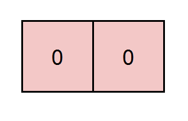

# 矩阵中和能被 K 整除的路径

给你一个下标从 **0** 开始的 `m x n` 整数矩阵 `grid` 和一个整数 `k` 。你从起点 `(0, 0)` 出发，每一步只能往 **下** 或者往 **右** ，你想要到达终点 `(m - 1, n - 1)` 。

请你返回路径和能被 `k` 整除的路径数目，由于答案可能很大，返回答案对 `10^9 + 7` **取余** 的结果。

**示例 1：**


```
输入：grid = [[5,2,4],[3,0,5],[0,7,2]], k = 3
输出：2
解释：有两条路径满足路径上元素的和能被 k 整除。
第一条路径为上图中用红色标注的路径，和为 5 + 2 + 4 + 5 + 2 = 18 ，能被 3 整除。
第二条路径为上图中用蓝色标注的路径，和为 5 + 3 + 0 + 5 + 2 = 15 ，能被 3 整除。
```

**示例 2：**



```
输入：grid = [[0,0]], k = 5
输出：1
解释：红色标注的路径和为 0 + 0 = 0 ，能被 5 整除。
```

**示例 3：**


```
输入：grid = [[7,3,4,9],[2,3,6,2],[2,3,7,0]], k = 1
输出：10
解释：每个数字都能被 1 整除，所以每一条路径的和都能被 k 整除。
```

**提示：**

- `m == grid.length`
- `n == grid[i].length`
- `1 <= m, n <= 5 * 10^4`
- `1 <= m * n <= 5 * 10^4`
- `0 <= grid[i][j] <= 100`
- `1 <= k <= 50`

**解答：**

**#**|**编程语言**|**时间（ms / %）**|**内存（MB / %）**|**代码**
--|--|--|--|--
1|javascript|420 / 100|81.6 / 100|[动态规划](./javascript/ac_v1.js)

来源：力扣（LeetCode）

链接：https://leetcode.cn/problems/paths-in-matrix-whose-sum-is-divisible-by-k

著作权归领扣网络所有。商业转载请联系官方授权，非商业转载请注明出处。
