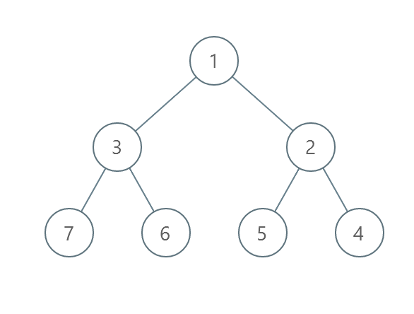

# 逐层排序二叉树所需的最少操作数目

给你一个 **值互不相同** 的二叉树的根节点 `root` 。

在一步操作中，你可以选择 **同一层** 上任意两个节点，交换这两个节点的值。

返回每一层按 **严格递增顺序** 排序所需的最少操作数目。

节点的 **层数** 是该节点和根节点之间的路径的边数。

**示例 1 ：**


``` javascript
输入：root = [1,4,3,7,6,8,5,null,null,null,null,9,null,10]
输出：3
解释：
- 交换 4 和 3 。第 2 层变为 [3,4] 。
- 交换 7 和 5 。第 3 层变为 [5,6,8,7] 。
- 交换 8 和 7 。第 3 层变为 [5,6,7,8] 。
共计用了 3 步操作，所以返回 3 。
可以证明 3 是需要的最少操作数目。
```

**示例 2 ：**



``` javascript
输入：root = [1,3,2,7,6,5,4]
输出：3
解释：
- 交换 3 和 2 。第 2 层变为 [2,3] 。 
- 交换 7 和 4 。第 3 层变为 [4,6,5,7] 。 
- 交换 6 和 5 。第 3 层变为 [4,5,6,7] 。
共计用了 3 步操作，所以返回 3 。 
可以证明 3 是需要的最少操作数目。
```

**示例 3 ：**


``` javascript
输入：root = [1,2,3,4,5,6]
输出：0
解释：每一层已经按递增顺序排序，所以返回 0 。
```

**提示：**

- 树中节点的数目在范围 `[1, 10^5]` 。
- `1 <= Node.val <= 10^5`
- 树中的所有值 **互不相同** 。

**解答：**

**#**|**编程语言**|**时间（ms / %）**|**内存（MB / %）**|**代码**
--|--|--|--|--
1|javascript|312 / 100.00|83.1 / 93.64|[BFS&离散化](./javascript/ac_v1.js)

来源：力扣（LeetCode）

链接：https://leetcode.cn/problems/minimum-number-of-operations-to-sort-a-binary-tree-by-level

著作权归领扣网络所有。商业转载请联系官方授权，非商业转载请注明出处。
