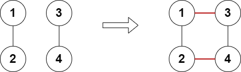
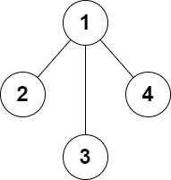

# 添加边使所有节点度数都为偶数

给你一个有 `n` 个节点的 **无向** 图，节点编号为 `1` 到 `n` 。再给你整数 `n` 和一个二维整数数组 `edges` ，其中 `edges[i] = [ai, bi]` 表示节点 `ai `和 `bi` 之间有一条边。图不一定连通。

你可以给图中添加 **至多** 两条额外的边（也可以一条边都不添加），使得图中没有重边也没有自环。

如果添加额外的边后，可以使得图中所有点的度数都是偶数，返回 `true` ，否则返回 `false` 。

点的度数是连接一个点的边的数目。

**示例 1：**


``` javascript
输入：n = 5, edges = [[1,2],[2,3],[3,4],[4,2],[1,4],[2,5]]
输出：true
解释：上图展示了添加一条边的合法方案。
最终图中每个节点都连接偶数条边。
```

**示例 2：**



``` javascript
输入：n = 4, edges = [[1,2],[3,4]]
输出：true
解释：上图展示了添加两条边的合法方案。
```

**示例 3：**



``` javascript
输入：n = 4, edges = [[1,2],[1,3],[1,4]]
输出：false
解释：无法添加至多 2 条边得到一个符合要求的图。
```

**提示：**

- `3 <= n <= 10^5`
- `2 <= edges.length <= 10^5`
- `edges[i].length == 2`
- `1 <= ai, bi <= n`
- `ai != bi`
- 图中不会有重边

**解答：**

**#**|**编程语言**|**时间（ms / %）**|**内存（MB / %）**|**代码**
--|--|--|--|--
1|javascript|?? / ??|?? / ??|[??](./javascript/ac_v1.js)

来源：力扣（LeetCode）

链接：https://leetcode.cn/problems/add-edges-to-make-degrees-of-all-nodes-even

著作权归领扣网络所有。商业转载请联系官方授权，非商业转载请注明出处。
