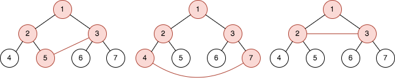
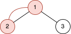

# 查询树中环的长度

给你一个整数 `n` ，表示你有一棵含有 `2^n - 1` 个节点的 **完全二叉树** 。根节点的编号是 `1` ，树中编号在 `[1, 2^(n - 1) - 1]` 之间，编号为 `val` 的节点都有两个子节点，满足：

- 左子节点的编号为 `2 * val`
- 右子节点的编号为 `2 * val + 1`

给你一个长度为 `m` 的查询数组 `queries` ，它是一个二维整数数组，其中 `queries[i] = [ai, bi]` 。对于每个查询，求出以下问题的解：

- 在节点编号为 `ai` 和 `bi` 之间添加一条边。
- 求出图中环的长度。
- 删除节点编号为 `ai` 和 `bi` 之间新添加的边。

**注意：**

- **环** 是开始和结束于同一节点的一条路径，路径中每条边都只会被访问一次。
- 环的长度是环中边的数目。
- 在树中添加额外的边后，两个点之间可能会有多条边。

请你返回一个长度为 `m` 的数组 `answer` ，其中 `answer[i]` 是第 `i` 个查询的结果。

**示例 1：**



``` javascript
输入：n = 3, queries = [[5,3],[4,7],[2,3]]
输出：[4,5,3]
解释：上图是一棵有 23 - 1 个节点的树。红色节点表示添加额外边后形成环的节点。
- 在节点 3 和节点 5 之间添加边后，环为 [5,2,1,3] ，所以第一个查询的结果是 4 。删掉添加的边后处理下一个查询。
- 在节点 4 和节点 7 之间添加边后，环为 [4,2,1,3,7] ，所以第二个查询的结果是 5 。删掉添加的边后处理下一个查询。
- 在节点 2 和节点 3 之间添加边后，环为 [2,1,3] ，所以第三个查询的结果是 3 。删掉添加的边。
```

**示例 2：**



``` javascript
输入：n = 2, queries = [[1,2]]
输出：[2]
解释：上图是一棵有 22 - 1 个节点的树。红色节点表示添加额外边后形成环的节点。
- 在节点 1 和节点 2 之间添加边后，环为 [2,1] ，所以第一个查询的结果是 2 。删掉添加的边。
```

**提示：**

- `2 <= n <= 30`
- `m == queries.length`
- `1 <= m <= 10^5`
- `queries[i].length == 2`
- `1 <= ai, bi <= 2n - 1`
- `ai != bi`

**解答：**

**#**|**编程语言**|**时间（ms / %）**|**内存（MB / %）**|**代码**
--|--|--|--|--
1|javascript|?? / ??|?? / ??|[??](./javascript/ac_v1.js)

来源：力扣（LeetCode）

链接：https://leetcode.cn/problems/cycle-length-queries-in-a-tree

著作权归领扣网络所有。商业转载请联系官方授权，非商业转载请注明出处。
