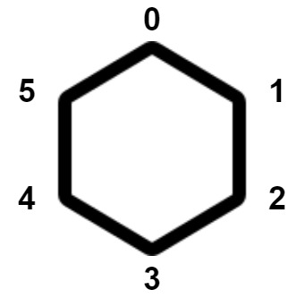

# 猴子碰撞的方法数

现在有一个正凸多边形，其上共有 `n` 个顶点。顶点按顺时针方向从 `0` 到 `n - 1` 依次编号。每个顶点上 **正好有一只猴子** 。下图中是一个 6 个顶点的凸多边形。



每个猴子同时移动到相邻的顶点。顶点 `i` 的相邻顶点可以是：

- 顺时针方向的顶点 `(i + 1) % n` ，或
- 逆时针方向的顶点 `(i - 1 + n) % n` 。

如果移动后至少有两个猴子位于同一顶点，则会发生 **碰撞** 。

返回猴子至少发生 **一次碰撞** 的移动方法数。由于答案可能非常大，请返回对 `10^9+7` 取余后的结果。

**注意**，每只猴子只能移动一次。

**示例 1：**

``` javascript
输入：n = 3
输出：6
解释：共计 8 种移动方式。
下面列出两种会发生碰撞的方式：
- 猴子 1 顺时针移动；猴子 2 逆时针移动；猴子 3 顺时针移动。猴子 1 和猴子 2 碰撞。
- 猴子 1 逆时针移动；猴子 2 逆时针移动；猴子 3 顺时针移动。猴子 1 和猴子 3 碰撞。
可以证明，有 6 种让猴子碰撞的方法。
```

**示例 2：**

``` javascript
输入：n = 4
输出：14
解释：可以证明，有 14 种让猴子碰撞的方法。
```

**提示：**

- `3 <= n <= 10^9`

**解答：**

**#**|**编程语言**|**时间（ms / %）**|**内存（MB / %）**|**代码**
--|--|--|--|--
1|javascript|56 / 89.06|41 / 93.75|[快速幂](./javascript/ac_v1.js)

来源：力扣（LeetCode）

链接：https://leetcode.cn/problems/count-collisions-of-monkeys-on-a-polygon

著作权归领扣网络所有。商业转载请联系官方授权，非商业转载请注明出处。
