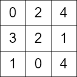

# 在网格图中访问一个格子的最少时间

给你一个 `m x n` 的矩阵 `grid` ，每个元素都为 **非负** 整数，其中 `grid[row][col]` 表示可以访问格子 `(row, col)` 的 **最早** 时间。也就是说当你访问格子 `(row, col)` 时，最少已经经过的时间为 `grid[row][col]` 。

你从 **最左上角** 出发，出发时刻为 `0` ，你必须一直移动到上下左右相邻四个格子中的 **任意** 一个格子（即不能停留在格子上）。每次移动都需要花费 1 单位时间。

请你返回 **最早** 到达右下角格子的时间，如果你无法到达右下角的格子，请你返回 `-1` 。

**示例 1：**


``` javascript
输入：grid = [[0,1,3,2],[5,1,2,5],[4,3,8,6]]
输出：7
解释：一条可行的路径为：
- 时刻 t = 0 ，我们在格子 (0,0) 。
- 时刻 t = 1 ，我们移动到格子 (0,1) ，可以移动的原因是 grid[0][1] <= 1 。
- 时刻 t = 2 ，我们移动到格子 (1,1) ，可以移动的原因是 grid[1][1] <= 2 。
- 时刻 t = 3 ，我们移动到格子 (1,2) ，可以移动的原因是 grid[1][2] <= 3 。
- 时刻 t = 4 ，我们移动到格子 (1,1) ，可以移动的原因是 grid[1][1] <= 4 。
- 时刻 t = 5 ，我们移动到格子 (1,2) ，可以移动的原因是 grid[1][2] <= 5 。
- 时刻 t = 6 ，我们移动到格子 (1,3) ，可以移动的原因是 grid[1][3] <= 6 。
- 时刻 t = 7 ，我们移动到格子 (2,3) ，可以移动的原因是 grid[2][3] <= 7 。
最终到达时刻为 7 。这是最早可以到达的时间。
```

**示例 2：**



``` javascript
输入：grid = [[0,2,4],[3,2,1],[1,0,4]]
输出：-1
解释：没法从左上角按题目规定走到右下角。
```

**提示：**

- `m == grid.length`
- `n == grid[i].length`
- `2 <= m, n <= 1000`
- `4 <= m * n <= 10^5`
- `0 <= grid[i][j] <= 10^5`
- `grid[0][0] == 0`

**解答：**

**#**|**编程语言**|**时间（ms / %）**|**内存（MB / %）**|**代码**
--|--|--|--|--
1|javascript|?? / ??|?? / ??|[??](./javascript/ac_v1.js)

来源：力扣（LeetCode）

链接：https://leetcode.cn/problems/minimum-time-to-visit-a-cell-in-a-grid

著作权归领扣网络所有。商业转载请联系官方授权，非商业转载请注明出处。
