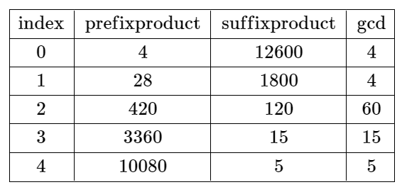

# 分割数组使乘积互质

给你一个长度为 `n` 的整数数组 `nums` ，下标从 **0** 开始。

如果在下标 `i` 处 **分割** 数组，其中 `0 <= i <= n - 2` ，使前 `i + 1` 个元素的乘积和剩余元素的乘积互质，则认为该分割 **有效** 。

- 例如，如果 `nums = [2, 3, 3]` ，那么在下标 `i = 0` 处的分割有效，因为 `2` 和 `9` 互质，而在下标 `i = 1` 处的分割无效，因为 `6` 和 `3` 不互质。在下标 `i = 2` 处的分割也无效，因为 `i == n - 1` 。

返回可以有效分割数组的最小下标 `i` ，如果不存在有效分割，则返回 `-1` 。

当且仅当 `gcd(val1, val2) == 1` 成立时，`val1` 和 `val2` 这两个值才是互质的，其中 `gcd(val1, val2)` 表示 `val1` 和 `val2` 的最大公约数。

**示例 1：**


``` javascript
输入：nums = [4,7,8,15,3,5]
输出：2
解释：上表展示了每个下标 i 处的前 i + 1 个元素的乘积、剩余元素的乘积和它们的最大公约数的值。
唯一一个有效分割位于下标 2 。
```

**示例 2：**



``` javascript
输入：nums = [4,7,15,8,3,5]
输出：-1
解释：上表展示了每个下标 i 处的前 i + 1 个元素的乘积、剩余元素的乘积和它们的最大公约数的值。
不存在有效分割。
```

**提示：**

- `n == nums.length`
- `1 <= n <= 10^4`
- `1 <= nums[i] <= 10^6`

**解答：**

**#**|**编程语言**|**时间（ms / %）**|**内存（MB / %）**|**代码**
--|--|--|--|--
1|javascript|?? / ??|?? / ??|[??](./javascript/ac_v1.js)

来源：力扣（LeetCode）

链接：https://leetcode.cn/problems/split-the-array-to-make-coprime-products

著作权归领扣网络所有。商业转载请联系官方授权，非商业转载请注明出处。
