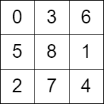

# 检查骑士巡视方案

骑士在一张 `n x n` 的棋盘上巡视。在有效的巡视方案中，骑士会从棋盘的 **左上角** 出发，并且访问棋盘上的每个格子 **恰好一次** 。

给你一个 `n x n` 的整数矩阵 `grid` ，由范围 `[0, n * n - 1]` 内的不同整数组成，其中 `grid[row][col]` 表示单元格 `(row, col)` 是骑士访问的第 `grid[row][col]` 个单元格。骑士的行动是从下标 **0** 开始的。

如果 `grid` 表示了骑士的有效巡视方案，返回 `true`；否则返回 `false`。

**注意**，骑士行动时可以垂直移动两个格子且水平移动一个格子，或水平移动两个格子且垂直移动一个格子。下图展示了骑士从某个格子出发可能的八种行动路线。


**示例 1：**


``` javascript
输入：grid = [[0,11,16,5,20],[17,4,19,10,15],[12,1,8,21,6],[3,18,23,14,9],[24,13,2,7,22]]
输出：true
解释：grid 如上图所示，可以证明这是一个有效的巡视方案。
```

**示例 2：**



``` javascript
输入：grid = [[0,3,6],[5,8,1],[2,7,4]]
输出：false
解释：grid 如上图所示，考虑到骑士第 7 次行动后的位置，第 8 次行动是无效的。
```

**提示：**

- `n == grid.length == grid[i].length`
- `3 <= n <= 7`
- `0 <= grid[row][col] < n * n`
- `grid` 中的所有整数 **互不相同**

**解答：**

**#**|**编程语言**|**时间（ms / %）**|**内存（MB / %）**|**代码**
--|--|--|--|--
1|javascript|80 / 43.70|43.2 / 70.59|[朴素方法](./javascript/ac_v1.js)

来源：力扣（LeetCode）

链接：https://leetcode.cn/problems/check-knight-tour-configuration

著作权归领扣网络所有。商业转载请联系官方授权，非商业转载请注明出处。
