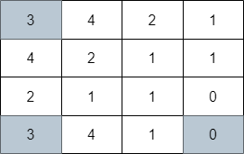

# 网格图中最少访问的格子数

给你一个下标从 **0** 开始的 `m x n` 整数矩阵 `grid` 。你一开始的位置在 **左上角** 格子 `(0, 0)` 。

当你在格子 `(i, j)` 的时候，你可以移动到以下格子之一：

- 满足 `j < k <= grid[i][j] + j` 的格子 `(i, k)` （向右移动），或者
- 满足 `i < k <= grid[i][j] + i` 的格子 `(k, j)` （向下移动）。

请你返回到达 **右下角** 格子 `(m - 1, n - 1)` 需要经过的最少移动格子数，如果无法到达右下角格子，请你返回 `-1` 。

**示例 1：**


``` javascript
输入：grid = [[3,4,2,1],[4,2,3,1],[2,1,0,0],[2,4,0,0]]
输出：4
解释：上图展示了到达右下角格子经过的 4 个格子。
```

**示例 2：**



``` javascript
输入：grid = [[3,4,2,1],[4,2,1,1],[2,1,1,0],[3,4,1,0]]
输出：3
解释：上图展示了到达右下角格子经过的 3 个格子。
```

**示例 3：**


``` javascript
输入：grid = [[2,1,0],[1,0,0]]
输出：-1
解释：无法到达右下角格子。
```

**提示：**

- `m == grid.length`
- `n == grid[i].length`
- `1 <= m, n <= 10^5`
- `1 <= m * n <= 10^5`
- `0 <= grid[i][j] < m * n`
- `grid[m - 1][n - 1] == 0`

**解答：**

**#**|**编程语言**|**时间（ms / %）**|**内存（MB / %）**|**代码**
--|--|--|--|--
1|javascript|524 / 100.00|79.9 / 100.00|[单调栈&二分查找](./javascript/ac_v1.js)

来源：力扣（LeetCode）

链接：https://leetcode.cn/problems/minimum-number-of-visited-cells-in-a-grid

著作权归领扣网络所有。商业转载请联系官方授权，非商业转载请注明出处。
