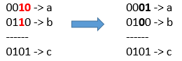

# 或运算的最小翻转次数

给你三个正整数 a、b 和 c。

你可以对 a 和 b 的二进制表示进行位翻转操作，返回能够使按位或运算   a OR b == c  成立的最小翻转次数。

「位翻转操作」是指将一个数的二进制表示任何单个位上的 1 变成 0 或者 0 变成 1 。

示例 1：



``` javascript
输入：a = 2, b = 6, c = 5
输出：3
解释：翻转后 a = 1 , b = 4 , c = 5 使得 a OR b == c
```

示例 2：

``` javascript
输入：a = 4, b = 2, c = 7
输出：1
```

示例 3：

``` javascript
输入：a = 1, b = 2, c = 3
输出：0
```

提示：

- 1 <= a <= 10^9
- 1 <= b <= 10^9
- 1 <= c <= 10^9

解答：

**#**|**编程语言**|**时间（ms / %）**|**内存（MB / %）**|**代码**
--|--|--|--|--
1|javascript|64 / 100|34.3 / 100|[正常解法](./javascript/ac_v1.js)

来源：力扣（LeetCode）

链接：https://leetcode-cn.com/problems/minimum-flips-to-make-a-or-b-equal-to-c

著作权归领扣网络所有。商业转载请联系官方授权，非商业转载请注明出处。
