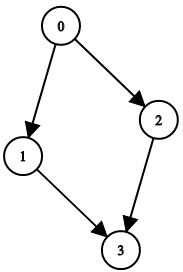
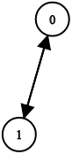

# 验证二叉树

二叉树上有 n 个节点，按从 0 到 n - 1 编号，其中节点 i 的两个子节点分别是 leftChild[i] 和 rightChild[i]。

只有 所有 节点能够形成且 只 形成 一颗 有效的二叉树时，返回 true；否则返回 false。

如果节点 i 没有左子节点，那么 leftChild[i] 就等于 -1。右子节点也符合该规则。

注意：节点没有值，本问题中仅仅使用节点编号。

示例 1：


``` javascript
输入：n = 4, leftChild = [1,-1,3,-1], rightChild = [2,-1,-1,-1]
输出：true
```

示例 2：



``` javascript
输入：n = 4, leftChild = [1,-1,3,-1], rightChild = [2,3,-1,-1]
输出：false
```

示例 3：



``` javascript
输入：n = 2, leftChild = [1,0], rightChild = [-1,-1]
输出：false
```

示例 4：


``` javascript
输入：n = 6, leftChild = [1,-1,-1,4,-1,-1], rightChild = [2,-1,-1,5,-1,-1]
输出：false
```

提示：

- 1 <= n <= 10^4
- leftChild.length == rightChild.length == n
- -1 <= leftChild[i], rightChild[i] <= n - 1

解答：

**#**|**编程语言**|**时间（ms / %）**|**内存（MB / %）**|**代码**
--|--|--|--|--
1|javascript|68 / 100|37.8 / 100|[统计节点入度](./javascript/ac_v1.js)

来源：力扣（LeetCode）

链接：https://leetcode-cn.com/problems/validate-binary-tree-nodes

著作权归领扣网络所有。商业转载请联系官方授权，非商业转载请注明出处。
