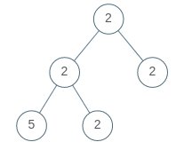

# Univalued Binary Tree

A binary tree is univalued if every node in the tree has the same value.

Return true if and only if the given tree is univalued.

**Example 1:**


``` javascript
Input: [1,1,1,1,1,null,1]
Output: true
```

**Example 2:**



``` javascript
Input: [2,2,2,5,2]
Output: false
```

**Note:**

- The number of nodes in the given tree will be in the range [1, 100].
- Each node's value will be an integer in the range [0, 99].

**解答：**

**#**|**编程语言**|**时间（ms / %）**|**内存（MB / %）**|**代码**
--|--|--|--|--
1|javascript|68 / 56.58|34 / 100|[广度优先](./javascript/ac_v1.js)
2|javascript|72 / 34.87|33.9 / 100|[深度优先](./javascript/ac_v2.js)

来源：力扣（LeetCode）

链接：https://leetcode-cn.com/problems/univalued-binary-tree

著作权归领扣网络所有。商业转载请联系官方授权，非商业转载请注明出处。
