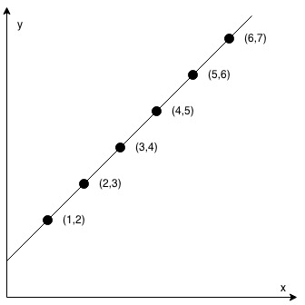

# 缀点成线

在一个 XY 坐标系中有一些点，我们用数组 coordinates 来分别记录它们的坐标，其中 coordinates[i] = [x, y] 表示横坐标为 x、纵坐标为 y 的点。

请你来判断，这些点是否在该坐标系中属于同一条直线上，是则返回 true，否则请返回 false。

**示例 1：**



``` javascript
输入：coordinates = [[1,2],[2,3],[3,4],[4,5],[5,6],[6,7]]
输出：true
```

**示例 2：**


``` javascript
输入：coordinates = [[1,1],[2,2],[3,4],[4,5],[5,6],[7,7]]
输出：false
```

**提示：**

- 2 <= coordinates.length <= 1000
- coordinates[i].length == 2
- -10^4 <= coordinates[i][0], coordinates[i][1] <= 10^4
- coordinates 中不含重复的点

来源：力扣（LeetCode）
链接：https://leetcode-cn.com/problems/check-if-it-is-a-straight-line
著作权归领扣网络所有。商业转载请联系官方授权，非商业转载请注明出处。

**提示：**

- m == grid.length
- n == grid[i].length
- 1 <= m, n <= 200
- grid[i][j] 为 0 或 1
- 1 <= hits.length <= 4 * 1e4
- hits[i].length == 2
- 0 <= xi <= m - 1
- 0 <= yi <= n - 1
- 所有 (xi, yi) 互不相同

**解答：**

**#**|**编程语言**|**时间（ms / %）**|**内存（MB / %）**|**代码**
--|--|--|--|--
1|javascript|96 / 31.09|39.3 / 63.03|[点斜式](./javascript/ac_v1.js)

来源：力扣（LeetCode）

链接：https://leetcode-cn.com/problems/bricks-falling-when-hit

著作权归领扣网络所有。商业转载请联系官方授权，非商业转载请注明出处。
