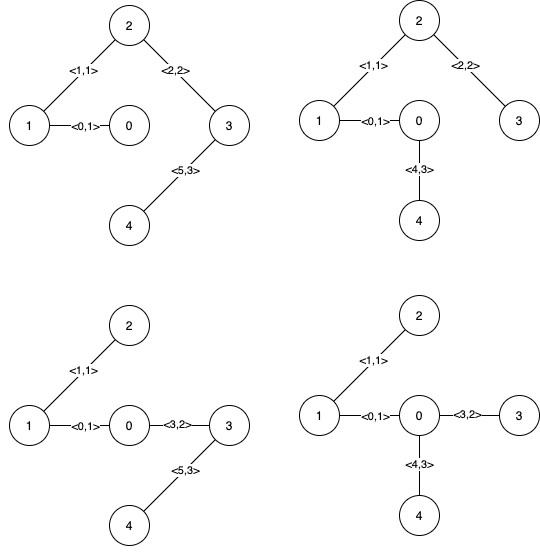

# 找到最小生成树里的关键边和伪关键边

给你一个 n 个点的带权无向连通图，节点编号为 0 到 n-1 ，同时还有一个数组 edges ，其中 edges[i] = [fromi, toi, weighti] 表示在 fromi 和 toi 节点之间有一条带权无向边。最小生成树 (MST) 是给定图中边的一个子集，它连接了所有节点且没有环，而且这些边的权值和最小。

请你找到给定图中最小生成树的所有关键边和伪关键边。如果从图中删去某条边，会导致最小生成树的权值和增加，那么我们就说它是一条关键边。伪关键边则是可能会出现在某些最小生成树中但不会出现在所有最小生成树中的边。

请注意，你可以分别以任意顺序返回关键边的下标和伪关键边的下标。

**示例 1：**


``` javascript
输入：n = 5, edges = [[0,1,1],[1,2,1],[2,3,2],[0,3,2],[0,4,3],[3,4,3],[1,4,6]]
输出：[[0,1],[2,3,4,5]]
解释：上图描述了给定图。
下图是所有的最小生成树。
```



``` javascript
注意到第 0 条边和第 1 条边出现在了所有最小生成树中，所以它们是关键边，我们将这两个下标作为输出的第一个列表。
边 2，3，4 和 5 是所有 MST 的剩余边，所以它们是伪关键边。我们将它们作为输出的第二个列表。
```

**示例 2 ：**


``` javascript
输入：n = 4, edges = [[0,1,1],[1,2,1],[2,3,1],[0,3,1]]
输出：[[],[0,1,2,3]]
解释：可以观察到 4 条边都有相同的权值，任选它们中的 3 条可以形成一棵 MST 。所以 4 条边都是伪关键边。
```

**提示：**

- 2 <= n <= 100
- 1 <= edges.length <= min(200, n * (n - 1) / 2)
- edges[i].length == 3
- 0 <= fromi < toi < n
- 1 <= weighti <= 1000
- 所有 (fromi, toi) 数对都是互不相同的。

**解答：**

**#**|**编程语言**|**时间（ms / %）**|**内存（MB / %）**|**代码**
--|--|--|--|--
1|javascript|?? / ??|?? / ??|[??](./javascript/ac_v1.js)

来源：力扣（LeetCode）

链接：https://leetcode-cn.com/problems/find-critical-and-pseudo-critical-edges-in-minimum-spanning-tree

著作权归领扣网络所有。商业转载请联系官方授权，非商业转载请注明出处。
