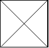

# 由斜杠划分区域

在由 1 x 1 方格组成的 N x N 网格 grid 中，每个 1 x 1 方块由 /、\ 或空格构成。这些字符会将方块划分为一些共边的区域。

（请注意，反斜杠字符是转义的，因此 \ 用 "\\" 表示。）。

返回区域的数目。

**示例 1：**

``` javascript
输入：
[
  " /",
  "/ "
]
输出：2
解释：2x2 网格如下：
```


**示例 2：**

``` javascript
输入：
[
  " /",
  "  "
]
输出：1
解释：2x2 网格如下：
```


**示例 3：**

``` javascript
输入：
[
  "\\/",
  "/\\"
]
输出：4
解释：（回想一下，因为 \ 字符是转义的，所以 "\\/" 表示 \/，而 "/\\" 表示 /\。）
2x2 网格如下：
```



**示例 4：**

``` javascript
输入：
[
  "/\\",
  "\\/"
]
输出：5
解释：（回想一下，因为 \ 字符是转义的，所以 "/\\" 表示 /\，而 "\\/" 表示 \/。）
2x2 网格如下：
```


**示例 5：**

``` javascript
输入：
[
  "//",
  "/ "
]
输出：3
解释：2x2 网格如下：
```


**提示：**

- 1 <= grid.length == grid[0].length <= 30
- grid[i][j] 是 '/'、'\'、或 ' '。

**解答：**

**#**|**编程语言**|**时间（ms / %）**|**内存（MB / %）**|**代码**
--|--|--|--|--
1|javascript|96 / 20.72|41.5 / 5.21|[朴素方法](./javascript/ac_v1.js)

来源：力扣（LeetCode）

链接：https://leetcode-cn.com/problems/regions-cut-by-slashes

著作权归领扣网络所有。商业转载请联系官方授权，非商业转载请注明出处。
