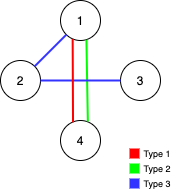
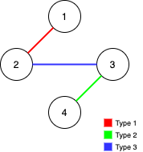

# 保证图可完全遍历

Alice 和 Bob 共有一个无向图，其中包含 n 个节点和 3  种类型的边：

- 类型 1：只能由 Alice 遍历。
- 类型 2：只能由 Bob 遍历。
- 类型 3：Alice 和 Bob 都可以遍历。

给你一个数组 edges ，其中 edges[i] = [typei, ui, vi] 表示节点 ui 和 vi 之间存在类型为 typei 的双向边。请你在保证图仍能够被 Alice和 Bob 完全遍历的前提下，找出可以删除的最大边数。如果从任何节点开始，Alice 和 Bob 都可以到达所有其他节点，则认为图是可以完全遍历的。

返回可以删除的最大边数，如果 Alice 和 Bob 无法完全遍历图，则返回 -1 。

**示例 1：**


``` javascript
输入：n = 4, edges = [[3,1,2],[3,2,3],[1,1,3],[1,2,4],[1,1,2],[2,3,4]]
输出：2
解释：如果删除 [1,1,2] 和 [1,1,3] 这两条边，Alice 和 Bob 仍然可以完全遍历这个图。再删除任何其他的边都无法保证图可以完全遍历。所以可以删除的最大边数是 2 。
```

**示例 2：**



``` javascript
输入：n = 4, edges = [[3,1,2],[3,2,3],[1,1,4],[2,1,4]]
输出：0
解释：注意，删除任何一条边都会使 Alice 和 Bob 无法完全遍历这个图。
```

**示例 3：**



``` javascript
输入：n = 4, edges = [[3,2,3],[1,1,2],[2,3,4]]
输出：-1
解释：在当前图中，Alice 无法从其他节点到达节点 4 。类似地，Bob 也不能达到节点 1 。因此，图无法完全遍历。
```

**提示：**

- 1 <= n <= 10^5
- 1 <= edges.length <= min(10^5, 3 * n * (n-1) / 2)
- edges[i].length == 3
- 1 <= edges[i][0] <= 3
- 1 <= edges[i][1] < edges[i][2] <= n
- 所有元组 (typei, ui, vi) 互不相同

**解答：**

**#**|**编程语言**|**时间（ms / %）**|**内存（MB / %）**|**代码**
--|--|--|--|--
1|javascript|752 / 14.29|111.6 / 14.29|[深度优先](./javascript/ac_v1.js)

来源：力扣（LeetCode）

链接：https://leetcode-cn.com/problems/remove-max-number-of-edges-to-keep-graph-fully-traversable

著作权归领扣网络所有。商业转载请联系官方授权，非商业转载请注明出处。
