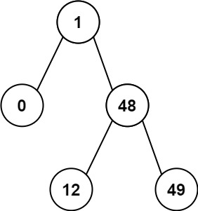

# 二叉搜索树节点最小距离

给你一个二叉搜索树的根节点 root ，返回 **树中任意两不同节点值之间的最小差值**。

注意：本题与 530：https://leetcode-cn.com/problems/minimum-absolute-difference-in-bst/ 相同

**示例 1：**


``` javascript
输入：root = [4,2,6,1,3]
输出：1
```

**示例 2：**



``` javascript
输入：root = [1,0,48,null,null,12,49]
输出：1
```

**提示：**

- 树中节点数目在范围 [2, 100] 内
- 0 <= Node.val <= 1e5

**解答：**

**#**|**编程语言**|**时间（ms / %）**|**内存（MB / %）**|**代码**
--|--|--|--|--
1|javascript|104 / 9.66|39.6 / 15.94|[中序遍历](./javascript/ac_v1.js)

来源：力扣（LeetCode）

链接：https://leetcode-cn.com/problems/minimum-distance-between-bst-nodes

著作权归领扣网络所有。商业转载请联系官方授权，非商业转载请注明出处。
