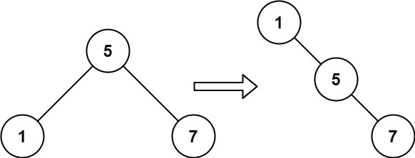

# 递增顺序搜索树

给你一棵二叉搜索树，请你 **按中序遍历** 将其重新排列为一棵递增顺序搜索树，使树中最左边的节点成为树的根节点，并且每个节点没有左子节点，只有一个右子节点。

**示例 1：**


``` javascript
输入：root = [5,3,6,2,4,null,8,1,null,null,null,7,9]
输出：[1,null,2,null,3,null,4,null,5,null,6,null,7,null,8,null,9]
```

**示例 2：**



``` javascript
输入：root = [5,1,7]
输出：[1,null,5,null,7]
```

**提示：**

- 树中节点数的取值范围是 [1, 100]
- 0 <= Node.val <= 1000

**解答：**

**#**|**编程语言**|**时间（ms / %）**|**内存（MB / %）**|**代码**
--|--|--|--|--
1|javascript|84 / 67.57|39.1 / 66.37|[动态规划](./javascript/ac_v1.js)

来源：力扣（LeetCode）

链接：https://leetcode-cn.com/problems/increasing-order-search-tree

著作权归领扣网络所有。商业转载请联系官方授权，非商业转载请注明出处。
