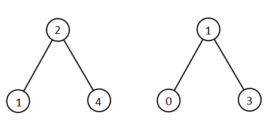

# 两棵二叉搜索树中的所有元素

给你 `root1` 和 `root2` 这两棵二叉搜索树。请你返回一个列表，其中包含 **两棵树** 中的所有整数并按 **升序** 排序。.

**示例 1：**



``` javascript
输入：root1 = [2,1,4], root2 = [1,0,3]
输出：[0,1,1,2,3,4]
```

**示例 2：**


``` javascript
输入：root1 = [1,null,8], root2 = [8,1]
输出：[1,1,8,8]
```

**提示：**

- 每棵树的节点数在 `[0, 5000]` 范围内
- `-10^5 <= Node.val <= 10^5`

**解答：**

**#**|**编程语言**|**时间（ms / %）**|**内存（MB / %）**|**代码**
--|--|--|--|--
1|javascript|132 / 99.01|52.6 / 76.24|[中序](./javascript/ac_v1.js)

来源：力扣（LeetCode）

链接：https://leetcode-cn.com/problems/all-elements-in-two-binary-search-trees

著作权归领扣网络所有。商业转载请联系官方授权，非商业转载请注明出处。
