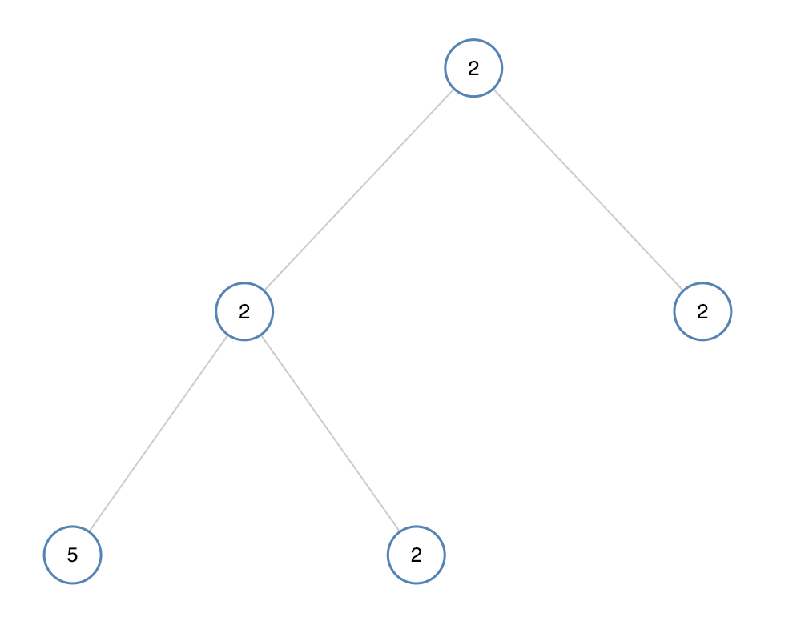

# 单值二叉树

如果二叉树每个节点都具有相同的值，那么该二叉树就是单值二叉树。

只有给定的树是单值二叉树时，才返回 `true`；否则返回 `false`。

**示例 1：**


``` javascript
输入：[1,1,1,1,1,null,1]
输出：true
```

**示例 2：**



``` javascript
输入：[2,2,2,5,2]
输出：false
```

**提示：**

- 给定树的节点数范围是 `[1, 100]`。
- 每个节点的值都是整数，范围为 `[0, 99]` 。

**解答：**

**#**|**编程语言**|**时间（ms / %）**|**内存（MB / %）**|**代码**
--|--|--|--|--
1|javascript|60 / 75.00|41.7 / 22.17|[先序](./javascript/ac_v1.js)

来源：力扣（LeetCode）

链接：https://leetcode.cn/problems/univalued-binary-tree

著作权归领扣网络所有。商业转载请联系官方授权，非商业转载请注明出处。
