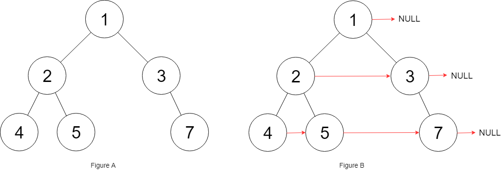

# 填充每个节点的下一个右侧节点指针 II

给定一个二叉树：

``` c
struct Node {
  int val;
  Node *left;
  Node *right;
  Node *next;
}
```

填充它的每个 next 指针，让这个指针指向其下一个右侧节点。如果找不到下一个右侧节点，则将 next 指针设置为 `NULL` 。

初始状态下，所有 next 指针都被设置为 `NULL` 。

**示例 1：**



``` javascript
输入：root = [1,2,3,4,5,null,7]
输出：[1,#,2,3,#,4,5,7,#]
解释：给定二叉树如图 A 所示，你的函数应该填充它的每个 next 指针，以指向其下一个右侧节点，如图 B 所示。序列化输出按层序遍历顺序（由 next 指针连接），'#' 表示每层的末尾。
```

**示例 2：**

``` javascript
输入：root = []
输出：[]
```

**提示：**

- 树中的节点数在范围 `[0, 6000]` 内
- `-100 <= Node.val <= 100`

**进阶：**

- 你只能使用常量级额外空间。
- 使用递归解题也符合要求，本题中递归程序的隐式栈空间不计入额外空间复杂度。

**解答：**

**#**|**编程语言**|**时间（ms / %）**|**内存（MB / %）**|**代码**
--|--|--|--|--
1|javascript|72 / 84.74|44.16 / 28.07|[按层填充](./javascript/ac_v1.js)

来源：力扣（LeetCode）

链接：https://leetcode.cn/problems/populating-next-right-pointers-in-each-node-ii

著作权归领扣网络所有。商业转载请联系官方授权，非商业转载请注明出处。
